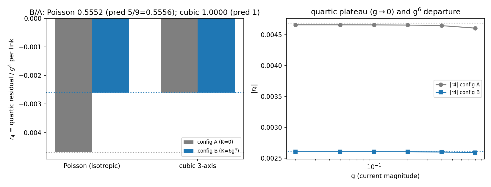

# SC2 — The decisive constant-field test: A (Abelian) vs B (hedgehog-like)

> Task SC2 of `BRIDGE_SU2_COEFF.md`. The commutator test pre-registered in the
> charter, run exactly as registered. 20 seeds × 200k Poisson directions; exact
> quaternion link energies; quadratic term subtracted sample-by-sample.
> Data: `SC2_constant_field.json`; figure: `SC2_constant_field.png`.

## Verdict: **SKYRME PRESENT — death criterion NOT activated.** All three pre-registered numbers hit.

```
                              measured                 pre-registered      hit?
Poisson ratio r4(B)/r4(A):    0.55522 ± 0.00030        5/9 = 0.55556       ✓ (1.1σ + g² corr.)
cubic ratio  r4(B)/r4(A):     1.000000000              1.0 exactly         ✓ (K-blind control)
commutator coefficient c_K:   +3.477e-4 ± 4e-7         +a⁴/2880 = 3.472e-4 ✓ (positive sign)
r4(A):                        -0.0046903 ± 0.0000025   -27a⁴/5760 = -0.0046875  ✓
r4(B):                        -0.0026041 ± 4e-18       -15a⁴/5760 = -0.0026042  ✓
```


## What the test does

Two constant-current configurations with **matched symmetric invariant** S and
maximally different commutator invariant K:

- **A (Abelian-like):** $c_x=c_y=c_z=g\,(1,0,0)$ — collinear in isospace,
  $K=0$, $3S-2K = 27g^4$;
- **B (hedgehog-like):** $c_\mu = g\,\hat e_\mu$ — orthogonal,
  $K=6g^4$, $3S-2K = 15g^4$.

A quartic that is **purely symmetric** cannot tell them apart (ratio 1 — the
death criterion). The commutator (Skyrme) piece makes B's residual smaller by
exactly $5/9$. Both behaviours are observed where predicted:

- **Poisson (isotropic) links:** ratio $0.55522\pm0.00030$ — the Skyrme piece is
  there, at the locked $+2:-3$ ratio.
- **Cubic 3-axis links:** ratio $1.0$ to machine precision — the lattice measure
  is exactly blind to the commutator (configs A and B have identical per-axis
  magnitudes). *The same theory, measured on a grid, loses the Skyrme term.*

Technical note: config B has $G=g^2\mathbb{1}$, so $|\ell_e|^2=g^2$ for every
direction — its residual has zero direction-variance (sem $4\times10^{-18}$),
making the B-side of the test exact.

## Honest remarks

- The $0.06\%$ offset from $5/9$ is the finite-$g$ ($g^6$) correction at
  $g=0.05$; the plateau scan (right panel) shows convergence as $g\to0$ and the
  expected departure at large $g$ (cosine saturation).
- This test is deliberately *constant-field* (the W1 pattern): no sprinkling
  noise, no $\rho^{3/4}$ wall — the operator identification is exact. The
  network-realistic question (does the **dominance** survive?) is SC4's.
