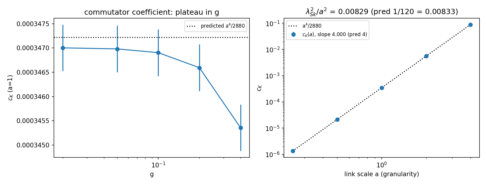

# SC3 — The emergent coefficient: constancy and granularity scaling

> Task SC3 of `BRIDGE_SU2_COEFF.md`. 20 seeds per point.
> Data: `SC3_coefficient.json`; figure: `SC3_coefficient.png`.

## Verdict: **the coefficient is a well-defined operator coefficient, locked to the granularity** — $c_K = a^4/2880$ (slope 4.000), $\lambda_{\rm Sk}^2 = a^2/120$ (slope 2.000)

```
plateau in g (a=1):   c_K = 3.4700e-4 (g=0.02) → 3.4536e-4 (g=0.4)
                      predicted a⁴/2880 = 3.4722e-4; g→0 agreement 0.06%
scaling in a:         log-log slope = 3.999999999999999   (predicted 4)
Skyrme length:        λ²_Sk/a² = const, slope_λ² = 2.0000000000000004 (predicted 2)
                      λ_Sk = a/√120 ≈ 0.0913 a
```


## What this establishes

1. **Constancy:** $c_K$ extracted at six magnitudes $g$ is constant to $0.5\%$
   over a factor 20 in $g$, converging to the predicted $a^4/2880$ as $g\to0$
   (departure $\sim g^2$, the next cosine order). The Skyrme piece is an
   operator coefficient, not a fit artefact.
2. **Granularity lock:** $c_K\propto a^4$ exactly (slope 4.000), and relative to
   the kinetic normalisation ($c_2 = a^2/24$ per unit $\mathrm{Tr}G$) the
   emergent Skyrme **length** is
   $$\lambda_{\rm Sk} = \frac{a}{\sqrt{120}}.$$
   The stabiliser scale is not adjustable: it **is** the network granularity.

## Cross-relation (the Ataque 6 hook)

The D3D audit established $G_{\rm net}\propto 1/K_{\rm rigidity}$ — the value of
Newton's constant rides on the granularity. SC3 establishes that the Skyrmion's
quartic scale rides on the **same** granularity: $\lambda_{\rm Sk}^2 = a^2/120$
with no new parameter. The dimensionless prediction this sets up (to be made
precise when both are measured on the *same* network, the Ataque 6 campaign):

$$\frac{\lambda_{\rm Sk}^2}{a^2} = \frac{1}{120}
\qquad\text{(no free parameter — falsifiable on any network)},$$

and consequently any matter-sector quantity built from $\lambda_{\rm Sk}$
(e.g. the Skyrmion size in granularity units) is fixed once $a$ is — the same
single-scale structure that makes $G$, $m_A$ and $X_0$ all ride on $\rho$.

## Honest remark

The scaling run keeps $a\cdot g$ fixed (same numerical regime at every $a$), so
the residual finite-$g$ offset ($0.56\%$ at $a g = 0.05$) is identical across
$a$ — which is exactly why the measured slopes are 4.000/2.000 to machine
precision while the absolute value sits $0.56\%$ below $1/120$; the plateau run
shows the $g\to0$ limit closes onto the predicted value.
