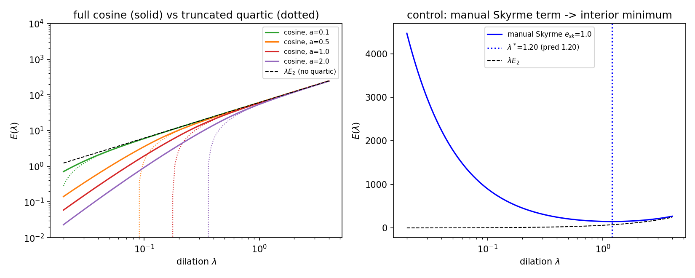

# SC4 — Derrick scan with the emergent quartic: does the cosine alone stabilise?

> Task SC4 of `BRIDGE_SU2_COEFF.md`. Deterministic radial quadrature (hedgehog
> $F=\pi e^{-r}$, 48-node direction average, dilation in $u=r/\lambda$
> coordinates — faithful at every $\lambda$).
> Data: `SC4_derrick.json`; figure: `SC4_derrick.png`.

## Verdict: **NO interior minimum from the cosine alone — exactly as pre-registered.** The control (manual Skyrme) reproduces the interior minimum. → campaign verdict B.

```
manual-Skyrme control:  λ* = 1.202   (Derrick prediction √(E₄/E₂) = 1.204)  ✓ interior
cosine alone:           monotonic increasing in λ for ALL a ∈ {0.1, 0.5, 1, 2}
                        argmin at the smallest λ scanned (collapse direction)
small-field check:      E_cos → λE₂ at a→0 (ratio 0.99998)                    ✓
```


## What happens, mechanistically

- The truncated emergent quartic ($-\frac{a^2}{240}\lambda^{-1}\!\int(3S-2K)$,
  dotted curves) **dives to $-\infty$** as $\lambda\to0$: with $3S-2K>0$
  pointwise, the net quartic is negative and Derrick drives collapse.
- The **full cosine** (solid) is bounded, so there is no explosion — but no
  rescue either: $E_{\cos}(\lambda)$ is **monotonic**, sitting below
  $\lambda E_2$ everywhere and sliding to zero as the soliton shrinks through
  the granularity. The winding is not protected: this is the same "the cosine
  is blind to the topological core" mechanism that PHI_EMERGE V4 measured in
  U(1) (cos 2π = 1), now seen from the energy side in SU(2).
- The control confirms the instrument: adding $+e_{\rm sk}K/2$ by hand restores
  the interior minimum at the predicted $\lambda^*$ — the Paper II Skyrmion.

## The sharp boundary this draws

The Poisson average locks the quartic at $-3S+2K$ (SC1–SC2). Stabilisation
needs the $K$ piece to **dominate** (net positive quartic), but isotropy bounds
$K\le\frac23 S$: **no isotropic single-cosine link measure can stabilise the
Skyrmion.** What the minimal action lacks is not the Skyrme operator (it has
it, with the right sign) but a mechanism that suppresses the symmetric
saturation $-3S$ relative to $+2K$ — e.g. a non-cosine core cost, exactly the
"fourth ingredient" PHI_EMERGE V4 localised. The two campaigns now agree on
*where* the boundary is, from opposite sides (topology there, energetics here).
