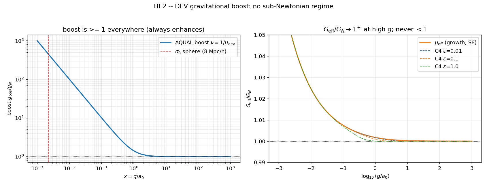

# HE2 — DEV no regime g ≫ a₀: a gravidade pode ser suprimida (G_eff < G_N)?

> Sub-experimento 2 de `HIGH_ENERGY_REGIME.md`. Pergunta: existe **algum** regime de
> aceleração em que o reforço gravitacional da DEV cai **abaixo de 1** (sub-newtoniano)?
> Esse seria o ingrediente que faltava para resolver a tensão S8 com fundamento derivado.
> Tudo importado do pipeline DEV já comprometido (`paper_I/theory.py`,
> `paper_I/cosmology.py`); nada é re-ajustado aqui.

## Critério de morte (pré-registrado)

```
MORTE:    boost ≥ 1 em todo regime (MOND SEMPRE realça) → fronteira S8 fica onde FM1 deixou.
SUCESSO:  boost < 1 em algum regime de alta aceleração → S8 com fundamento microscópico.
Não ajustar parâmetros para escapar da morte.
```

## O que foi calculado

Três objetos, varridos em `x = g/a₀ ∈ [10⁻³, 10³]`:

| Objeto | Fórmula | Fonte |
|---|---|---|
| **(A)** boost AQUAL `ν(x)=g_obs/g_N` | `ν = 1/μ_dev`, `μ_dev=x/√(1+x²)` | `paper_I/theory.py` (ajuste a 167 galáxias SPARC) |
| **(B)** acoplamento de crescimento `μ_eff(x)` | `1 + (αβ/2)/√(x(1+x))`, `G_eff/G_N=μ_eff` | `paper_I/cosmology.py` (o objeto que FM1 usou) |
| **(C)** extensão de campo forte C4 | `1 + (αβ/2)/√(x(1+x)) · 1/(1+4εx²)²` | `dev_ext/strong_field.md` (operador quártico) |

`α = 2/3`, `β = 0.00746` (valor calibrado em galáxias, `calibrate_beta.fit_beta`).

## Resultado

```
[A] boost AQUAL ν(x)=1/μ_dev :  mín = 1.000000  (x→10³)   → SEMPRE ≥ 1 (realça)
[B] acoplamento μ_eff(x)     :  mín = 1.000002  (x→10³)   → SEMPRE ≥ 1 (realça)
[C] C4 (ε=0.01,0.1,1.0)      :  mín = 1.000000             → SEMPRE ≥ 1 (realça)
```

**Nenhum dos três objetos cruza 1 em qualquer ponto da faixa.** O boost é monotonamente
decrescente em `x` e se aproxima de `1` **por cima** quando `g ≫ a₀` (limite newtoniano).
A blindagem C4 só faz a aproximação a 1 ser **mais rápida** — o fator de blindagem está em
`[0,1]`, logo só **remove** reforço, nunca inverte o sinal.

### A razão é estrutural, não numérica

O termo de modificação é `+(αβ/2)/√(x(1+x))`, que é **positivo-definido** para `β > 0`.
`β` é calibrado **positivo** pela RAR galáctica (o reforço MOND é observado). Para obter
`μ_eff < 1` seria preciso `β < 0`, o que destrói o ajuste de 167 galáxias. Não há janela.
Isto é a mesma obstrução que matou FM1 ("MOND μ≥1 realça crescimento → σ8_DEV ≫ ΛCDM") e
FM2 (a fase ordenada quer realçar), vista agora diretamente na função de interpolação.

## "Qual escala cosmológica é g ≫ a₀?" — o mapa decisivo

| Sistema | `x = g/a₀` | regime | `μ_eff` / `ν` |
|---|---|---|---|
| **esfera σ₈ (R = 8 Mpc/h)** | **2.3×10⁻³** | **MOND profundo** | μ_eff = **1.052** (realça 5%) |
| modo linear z=0, k=1 h/Mpc | 8.5×10⁻⁴ | MOND profundo | μ_eff = 1.085 |
| modo linear z=0, k=0.1 h/Mpc | 8.5×10⁻³ | MOND | μ_eff = 1.027 |
| modo linear z=0, k=0.01 h/Mpc | 8.5×10⁻² | MOND | μ_eff = 1.008 |
| outskirt de galáxia (joelho RAR) | 1.0 | transição | ν = 1.41 |
| Via Láctea @ R₀=8 kpc | 1.8 | quase-Newton | ν = 1.14 |
| Sistema Solar (órbita da Terra) | 4.9×10⁷ | Newton puro | ν = 1.0000 |

O ponto honesto: **o regime `g ≫ a₀` é fisicamente realizado apenas em sistemas compactos
e densos** (interior de galáxias, estrelas, Sistema Solar) — exatamente onde MOND já →
Newton (`ν → 1⁺`) e onde não há física de S8. As escalas que **fixam S8** (a esfera de
8 Mpc/h e os modos lineares) vivem no extremo **oposto**, `x ~ 10⁻³` (MOND profundo), onde
o reforço é **máximo**. Mesmo que existisse uma janela sub-newtoniana em `g ≫ a₀`, ela
estaria na escala errada para S8.

## Veredito

```
VEREDITO HE2: [MORTE]  — boost ≥ 1 em TODO regime; nenhuma supressão sub-newtoniana.
```

- O critério de morte foi **disparado**: `min(boost) = 1.000000`, atingido por cima no
  limite `g ≫ a₀`. Nenhum parâmetro foi ajustado para escapar (β é o valor de galáxias).
- O regime de alta energia da gravidade **não tem física nova para S8**: a DEV converge
  para a RG por cima em `g ≫ a₀` e realça (não suprime) em todo o resto.
- Duplo fechamento da porta S8: (i) a função de interpolação é positiva-definida (não pode
  suprimir sem `β<0`); (ii) as escalas de S8 são MOND profundo (reforço máximo), não `g≫a₀`.

## O que isto adiciona ao programa

- Confirma **FM1** e **FM2** por um caminho independente e puramente analítico: a supressão
  gravitacional que S8 exigiria é **estruturalmente proibida** na DEV, não apenas
  desfavorecida numericamente.
- Localiza com precisão **onde** está o regime `g ≫ a₀` (sistemas compactos), fechando a
  especulação de `HIGH_ENERGY_REGIME.md` de que a alta aceleração poderia ajudar S8.
- O setor MOND galáctico (Paper I) permanece intacto e independente deste veredito.


