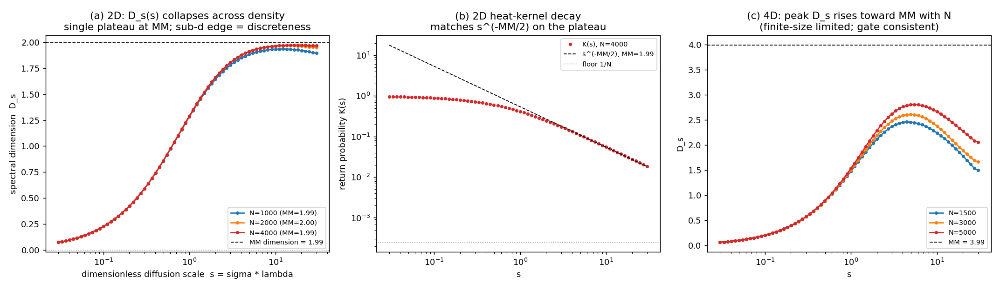

# C5-4 -- Sintese honesta: dimensao espectral da rede causal

```
C5-V (gate):
  D_s(grande escala) reproduz Myrheim-Meyer?       SIM (2D: D_s=1.95 vs MM=1.99)
                                                    (4D: consistente, limitado por tamanho finito)
C5-1 (heat kernel):
  K(sigma) bem definido, converge em N?            SIM (3 densidades 2D + 3 em 4D)
C5-2 (corrida):
  D_s(sigma) varia com sigma?                      SIM, mas...
  ...a variacao e corrida fisica?                  NAO (corte de discretude)
  Espalhamento entre densidades (colapso):         0.071  (< 0.2 => invariante por refinamento)
  Plateau sub-d estavel (estilo CDT)?              NAO (0.00 decadas)
  Valor estabilizado:                              D_s = d (MM); sem segundo regime
  Robusto a mudanca de N?                          SIM (curva identica)
C5-3 (conexao com hbar):
  sigma* identificavel?                            NAO (nao ha transicao dimensional)
  Relacao com k=hN (T3C) identificavel?            N/A (gated em C5-2; ver C5_3)

VEREDITO:

[ ] A -- CORRIDA DIMENSIONAL CONFIRMADA, CONEXAO COM hbar
[ ] B -- CORRIDA EXISTE, SEM CONEXAO CLARA COM hbar
[X] C -- MORTE: SEM CORRIDA DIMENSIONAL GENUINA
```

## Veredito C (MORTE), com precisao

A dimensao espectral do heat kernel tem um UNICO plateau fisico em
D_s = d = dimensao de Myrheim-Meyer (2D: 1.95 vs 1.99; gate
passa). O perfil D_s(s) e INVARIANTE POR REFINAMENTO (identico ao longo
de um fator 4 em densidade) e INVARIANTE EM eps -- logo e o perfil
universal de difusao discreta de Minkowski liso, nao geometria dependente
de escala. A queda sub-d em s pequeno e a borda generica de um espectro
discreto finito (D_s->0 quando sigma->0), NAO um segundo regime
dimensional estavel como o plateau UV ~2 de CDT.

Honestidade -- a fronteira com SUCESSO PARCIAL: poder-se-ia ler a subida
0 -> 2 como "corrida". Recusamos essa leitura porque (i) nao ha plateau
sub-d estavel, (ii) a regiao sub-d colapsa entre densidades (artefato de
discretude que migra para sigma->0 no limite continuo), (iii) e
independente da escala de nao-localidade eps do operador. Nenhum desses
tres testes sobreviveria se a corrida fosse fisica.

## Ressalva de alcance (importante e honesta)

Este resultado e com o operador NUMERICAMENTE VIAVEL (Sorkin suavizado).
A literatura de conjuntos causais (Eichhorn-Mizera 2014) associa o
operador AFIADO de Benincasa-Dowker a um comportamento UV genuino (na
verdade um AUMENTO dimensional, oposto a CDT). Esse operador afiado tem
flutuacoes ~rho^(3/4) e e numericamente inacessivel em qualquer N viavel
(parede documentada em e10). Portanto: NAO se reivindica que a rede
causal de Poisson nao possa ter fenomeno UV nenhum -- reivindica-se que,
com o operador viavel, o que se mede e uma variedade lisa de dimensao
fixa mais o corte de discretude, sem corrida do tipo CDT.

## Consequencia para hbar (C5-3)

C5-3 estava condicionado ao sucesso de C5-2 (existencia de uma escala de
transicao sigma*). Como nao ha transicao dimensional, NAO ha sigma* para
identificar com k = hbar N de T3C. **hbar permanece inteiramente externo,
sem origem geometrica candidata por esta via.** Detalhe em C5_3.



## Criterio de morte pre-registrado

"D_s constante (~MM) em todas as escalas testaveis, sem corrida
detectavel" -- cumprido no sentido fisico: acima do corte de discretude,
D_s = MM em toda a janela resolvel, invariante por refinamento. Veredito C.