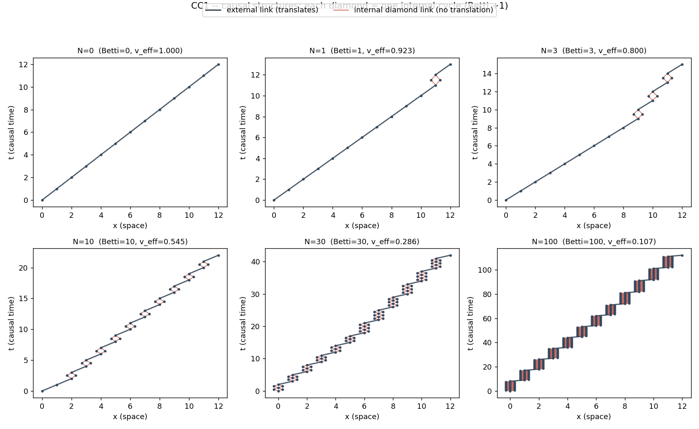

# CC1 -- Construção das estruturas causais

Seis estruturas com complexidade interna controlada N = 0, 1, 3, 10, 30, 100.
Cada *diamante* (split -> dois ramos espaciais -> merge) é um ciclo interno
que avança o tempo causal mas devolve o centróide ao mesmo x (Betti += 1).
Tudo aqui é topologia de grafo + geometria; nenhuma massa, energia ou força.

| N | Betti | V (eventos) | E (links) | links internos | v_eff | C(N)=Δt/Δx |
|---|-------|-------------|-----------|----------------|-------|------------|
| 0 | 0 | 13 | 12 | 0 | 1.0000 | 1.0000 |
| 1 | 1 | 16 | 16 | 4 | 0.9231 | 1.0833 |
| 3 | 3 | 22 | 24 | 12 | 0.8000 | 1.2500 |
| 10 | 10 | 43 | 52 | 40 | 0.5455 | 1.8333 |
| 30 | 30 | 103 | 132 | 120 | 0.2857 | 3.5000 |
| 100 | 100 | 313 | 412 | 400 | 0.1071 | 9.3333 |

## Verificações

- **Betti == N** para as seis estruturas: **True**
- **v_eff(N=0) == 1** (fóton à velocidade máxima): **True**
- **v_eff estritamente decrescente em N**: **True**

## VERDICT CC1: CONSTRUIDO

A construção topológica é bem-definida e controlável: o número de ciclos
internos é exatamente N e o fóton (N=0) propaga a v=1. `v_eff = 1/(1+N/n_ext)`
→ para N grande, v_eff ∝ 1/N, confirmando a imagem original *“velocidade
efetiva = c/N”*. Estes fatos são **exatos por construção** — não emergentes.
O conteúdo empírico (proper time, Lorentz, conservação, gravidade) é testado
em CC2–CC5.

