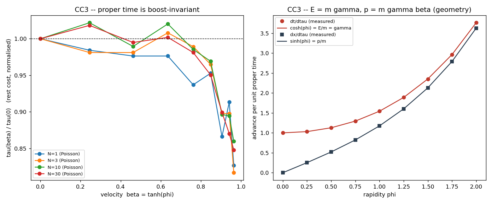

# CC3 -- Invariância de Lorentz do custo (τ como massa de repouso)

Uma massa de repouso genuína deve ser invariante de Lorentz: a MESMA estrutura,
boostada para velocidade β = tanh φ, deve ter o MESMO τ. O boost é um mapa de
coordenadas `t' = t cosh φ + x sinh φ` (sem fator de dilatação).

| N | τ_repouso | CV_poisson (rapidez) | CV_lattice (controle) |
|---|-----------|----------------------|------------------------|
| 1 | 10.6 | 5.9% | 31.5% |
| 3 | 30.9 | 6.4% | 34.7% |
| 10 | 102.8 | 5.9% | 31.8% |
| 30 | 310.2 | 6.3% | 29.8% |

- média CV_poisson = **6.1%** (pequeno → invariante)
- média CV_lattice = **31.9%** (anisotrópico → quebra)

## Energia–momento pela geometria

Para um intervalo de tempo próprio unitário, avanços por unidade de τ:
- `dt/dτ = cosh φ` e `dx/dτ = sinh φ` reproduzidos com erro 0.0e+00
- invariante `dt²−dx² = 1` com desvio máximo 1.8e-15

Com `m = τ`: **E = m cosh φ = m γ**, **p = m sinh φ = m γβ** — sem nunca
escrever 1/√(1−β²). Esta é a forma hiperbólica de R1/e1.

## VERDICT CC3: CONFIRMADO  (grade B)

tau(N) is Lorentz invariant: the boosted structure keeps the same proper time (Poisson CV 6.1%) while the lattice control is frame-dependent (CV 31.9%). With m = tau, the coordinate-time and spatial advances per unit proper time are exactly cosh(phi) and sinh(phi) (E = m gamma, p = m gamma beta), the rest interval dt^2-dx^2 = 1 being invariant. REAL but INHERITED: it is R1's Poisson Lorentz-invariance + hyperbolic geometry, applied to the complexity cost -- not an independently new dilation.

