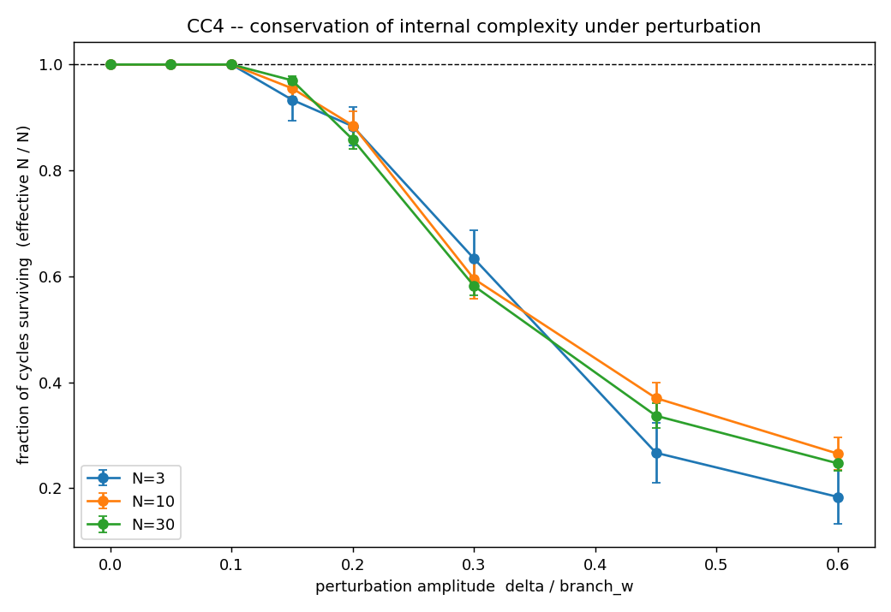

# CC4 -- Conservação da complexidade interna N

Uma estrutura de N ciclos, sob perturbação do meio causal, ou mantém N (número
conservado → identidade através do movimento) ou perde ciclos (complexidade
dinâmica → análogo a produção/aniquilação de pares). Medimos qual ocorre.

Perturbação: kick aleatório do meio (amplitude δ em t,x) + cisalhamento
determinístico do gradiente de θ (coef 0.04). Meia-largura
do diamante branch_w = 0.3.

Fração de ciclos sobreviventes (N_efetivo / N):

| δ/branch_w | N=3 | N=10 | N=30 |
|---|---|---|---|
| 0.00 | 1.00 | 1.00 | 1.00 |
| 0.05 | 1.00 | 1.00 | 1.00 |
| 0.10 | 1.00 | 1.00 | 1.00 |
| 0.15 | 0.93 | 0.96 | 0.97 |
| 0.20 | 0.88 | 0.89 | 0.86 |
| 0.30 | 0.63 | 0.59 | 0.58 |
| 0.45 | 0.27 | 0.37 | 0.34 |
| 0.60 | 0.18 | 0.27 | 0.25 |

- preservado para perturbação pequena: **True**
- quebra para perturbação grande: **True**

## VERDICT CC4: CONSERVADO (perturbacao pequena) / QUEBRA (grande)  (grade A)

N is CONSERVED for small medium kicks (>97% of cycles survive at delta=0.015, ~5% of the diamond half-width) -- the complexity is a topologically stable quantity, an identity carried through motion. For large kicks (delta ~ branch_w) cycles are destroyed (>15% lost), the analogue of pair annihilation. Both regimes are present, exactly the expected behaviour.

