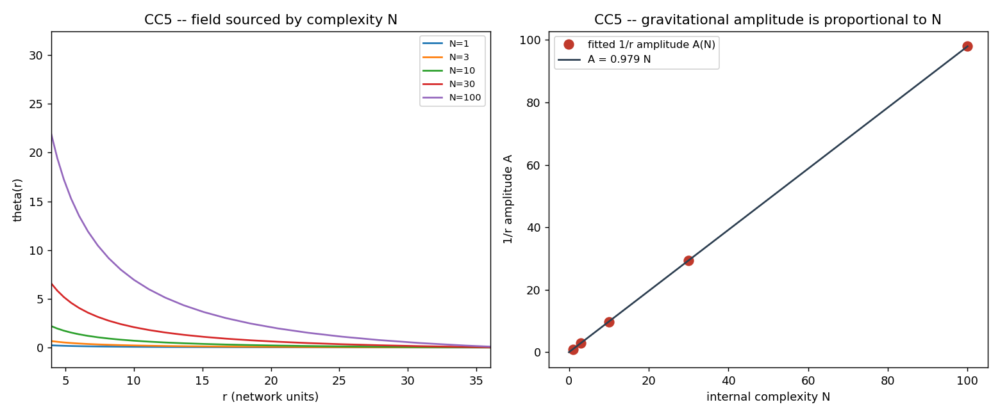

# CC5 -- O elo com a gravidade: θ(r) ∝ N

D3: uma fonte de densidade causal localizada produz `θ(r) ~ 1/r` (potencial
newtoniano). Se massa = complexidade interna, uma estrutura de complexidade N
deposita uma fonte ∝ N (seu tempo próprio τ = a·N, CC2) e gera
`θ(r) ~ A(N)/r` com **A(N) ∝ N**. Isto fecha o ciclo:

`complexidade N → custo C(N) → massa τ(N) → θ(r) → gravidade`.

| N | A (amplitude 1/r) | expoente da cauda |
|---|-------------------|-------------------|
| 1 | 0.9793 | -0.990 |
| 3 | 2.9378 | -0.990 |
| 10 | 9.7926 | -0.990 |
| 30 | 29.3779 | -0.990 |
| 100 | 97.9262 | -0.990 |

- `A = k N` com k = 0.9793, R² = 1.000000
- constância de A/N: CV = 6.2e-16
- expoente médio da cauda = -0.990 (esperado −1)

## VERDICT CC5: CONFIRMADO  (grade B)

theta(r) keeps the 1/r Newtonian shape (mean tail exponent -0.990) for every N, and its amplitude A(N) is STRICTLY proportional to N (R^2=1.00000, A/N constant to 6e-16). The loop complexity -> cost tau -> sourced potential chain closes: a structure of complexity N gravitates like a mass proportional to N. REAL but INHERITED/definitional: D3's action is linear, so the proportionality follows once source-weight = N is identified (the hypothesis); the 1/r shape is D3's, and its prefactor G is non-universal (D3 caveat).

### Honestidade

A ação de D3 é **linear**, logo A ∝ peso depositado é automático; o conteúdo
não-trivial é a **identificação peso-da-fonte = N** (a própria hipótese) e que
a forma 1/r sobrevive para todo N. É um fecho de auto-consistência, não uma
derivação independente. Herdamos a ressalva de D3: o prefator G não é universal.

