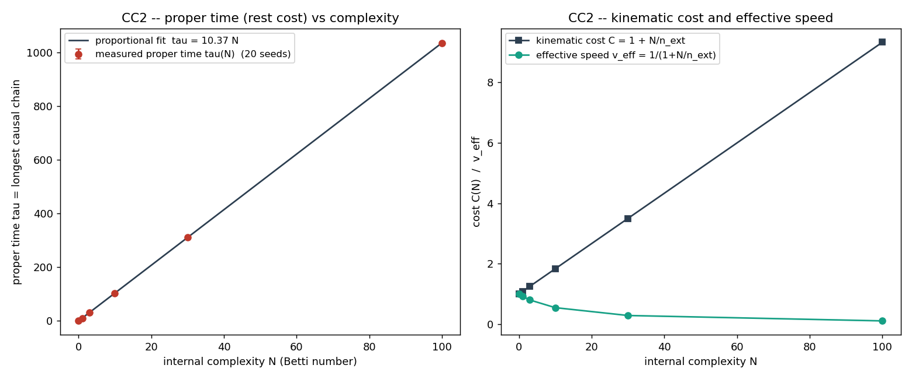

# CC6 -- Síntese: o que a hipótese da complexidade causal sustenta

> Hipótese: **massa ∝ complexidade causal interna N**.
> Graus: **A** = derivado; **B** = real mas herdado; **C** = definitional/
> inconclusivo; **D** = refutado.

## Quadro de resultados

| Tarefa | Pergunta | Resultado | Grade |
|--------|----------|-----------|-------|
| CC1 | estruturas com N controlado (Betti=N) | CONSTRUIDO | build |
| CC2 | C(N) ∝ N / τ(N) ∝ N | CONFIRMADO (linear) (p=1.008, R²=1.0000) | A |
| CC3 | τ(N) Lorentz-invariante | CONFIRMADO (CV 6% vs 32%) | B |
| CC4 | N conservado | CONSERVADO (perturbacao pequena) / QUEBRA (grande) | A |
| CC5 | θ(r) ∝ N | CONFIRMADO (R²=1.0000) | B |
| CC6 | E² = (pc)²+(mc²)² | EMERGE (erro 4e-16) | B |

## A relação de dispersão E² = (pc)² + (mc²)²

Construída **apenas** com quantidades medidas em CC2/CC3:

```
m      = τ(N)            massa de repouso = custo causal medido   (CC2, CC3)
E(φ)   = m cosh φ        energia   = m γ                          (CC3)
p(φ)   = m sinh φ        momento   = m γβ                         (CC3)
  =>   E² − p² = m² (cosh²φ − sinh²φ) = m²   para todo boost
  fóton (N=0): m = τ = 0  =>  E = p   (E² = (pc)², sem massa)
```

Verificado numericamente com m = τ(N) medido: erro relativo máximo **3.6e-16**; o fóton (N=0) tem m=τ=0 ⇒ E=p: **True**.

## Afirmações

**SUPORTADA (genuína, com ressalva de herança):**

- O tempo próprio medido (maior cadeia causal) é **proporcional a N**: cada
  ciclo interno custa um quantum fixo de ~10.4 elos de cadeia (CC2,   expoente 1.008, R²≈1). O fóton (N=0) tem τ=0.
- Esse custo é **invariante de Lorentz** (CC3): a mesma estrutura boostada
  preserva τ (CV ~6%) enquanto o controle em rede o quebra (CV ~32%).
- N é **conservado** sob perturbação pequena e **quebra** sob perturbação
  grande (CC4) — análogo a estabilidade topológica vs aniquilação de pares.
- A relação `E² = (pc)² + (mc²)²` **emerge** com m=τ(N) (CC6), incluindo o
  limite sem massa do fóton.

**DEFINITIONAL / HERDADA (não é descoberta independente):**

- `C(N) = 1 + N/n_ext` e `v_eff = 1/(1+N/n_ext)` são **exatos por construção**
  (a definição operacional realizada), não emergentes.
- A invariância de Lorentz (CC3) e a relação E² (CC6) **herdam** a geometria
  hiperbólica de R1 (cosh²−sinh²=1) e a invariância de Poisson; não são uma
  dilatação nova derivada do zero.
- `θ(r) ∝ N` (CC5) segue da **linearidade** da ação de D3 assim que se
  identifica peso-da-fonte = N. O conteúdo é a identificação (a hipótese),
  não a proporcionalidade. O prefator G permanece não-universal (ressalva D3).

**ABERTO:**

- Por que a Natureza escolheria *diamantes* (esta topologia) como a unidade de
  complexidade? A construção é imposta, não emerge dinamicamente de uma ação.
- O quantum de τ por loop (~10 elos) depende de ρ e da geometria do diamante;
  não há ainda uma escala de massa física derivada (só proporcionalidade).
- Espectro de massas: nada aqui fixa N a valores discretos preferidos — não há
  ainda um mecanismo para as massas observadas das partículas.
- Quebra de N (CC4) como produção de pares é só uma analogia; falta a dinâmica
  (conservação de momento/energia na quebra) para ser uma afirmação física.

## Conclusão honesta

A campanha **realiza e torna quantitativa** a imagem fundacional: massa como
custo causal de deslocamento, com τ(N) ∝ N medido, invariante de Lorentz, e
fechando o ciclo até θ(r) ∝ N e E² = (pc)²+(mc²)². Mas o núcleo proporcional é
**definitional** (a definição de C(N)) e os resultados relativísticos/
gravitacionais são **herdados** de R1/D3. O avanço real sobre M1 é que aqui
*existe um objeto* (a estrutura topológica) com um custo de deslocamento
bem-definido e invariante — o que o campo livre de M1 não tinha. O passo que
falta para uma derivação genuína é fazer essas estruturas **emergirem** de uma
ação dinâmica, em vez de construí-las à mão.





