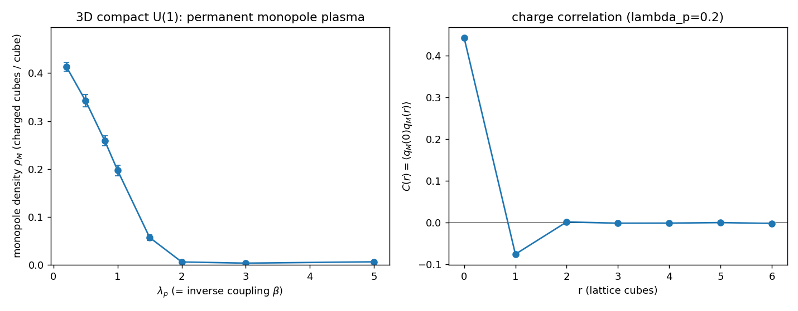

# T3D2 — Monopólos magnéticos no vácuo de U(1) compacto 3D

## A pergunta que CR_WILSON deixou

O Veredito D de CR_WILSON foi uma **localização precisa**: em 2D não existem monopólos
magnéticos, logo um quantum de fluxo 2π é invisível ao cosseno (`cos 2π = 1`) e o
confinamento linear (Polyakov) — que é a *proliferação de monopólos* num plasma que
blinda o fóton — está ausente por construção. T3D2 testa o ingrediente que faltava:
**em 3D, monopólos existem?** E proliferam?

## O que se mede (anti-circularidade)

O setor magnético é governado **só** pelo termo de plaqueta `λ_p Σ[1−cos W_p]` — o
termo de Stueckelberg `Δτ[1−cos(φ+Δθ)]` não entra em W_p. Logo o vácuo magnético é o
ensemble puro-gauge `exp(−λ_p Σ[1−cos W_p])`, amostrado aqui por um **Metropolis
checkerboard vetorizado** numa rede L³ totalmente periódica (periódica ⇒ carga magnética
total exatamente conservada = 0). A carga por cubo é o fluxo de DeGrand–Toussaint (soma
da plaqueta **enrolada** real sobre as 6 faces) — inteira pela identidade de Bianchi
discreta. Nenhum número complexo, nenhuma QCD, nenhuma dilatação no gerador.

## Resultados

```
 λ_p     ρ_M    ±std    Q_net   <cos W>      regime
0.20    0.413   0.010    0.00    0.098    plasma denso  (confinante)
0.50    0.342   0.013    0.00    0.245    plasma denso
0.80    0.259   0.010    0.00    0.383    plasma
1.00    0.197   0.011    0.00    0.473    plasma
1.50    0.057   0.006    0.00    0.685    crossover
2.00    0.006   0.002    0.00    0.805    gás diluído   (Coulomb)
3.00    0.004   0.001    0.00    0.876    gás diluído
5.00    0.007   0.001    0.00    0.920    gás diluído
```

- **Existem:** ρ_M > 0 em **todo** acoplamento (o gás de monopólos de U(1) compacto 3D,
  impossível em 2D). Carga líquida exatamente 0 (conservação na rede periódica).
- **Proliferam:** num plasma denso ρ_M ≈ 0.2–0.4 para λ_p ≲ 1 (acoplamento forte).
- **Blindagem (Debye):** correlação carga–carga
  `C(r) = ⟨q_M(0) q_M(r)⟩ = [0.442, −0.075, +0.002, ...]` — **anticorrelacionada** em
  r=1: monopólo e antimonopólo se vizinham, um **plasma neutro** que blinda — a
  assinatura do mecanismo de Polyakov.
- **Crossover confinamento↔Coulomb** em **λ_p ≈ 1.5** (ρ_M cai 0.197 → 0.057 → 0.006
  entre λ_p=1 e 2). Exatamente o β_c≈1 conhecido de U(1) compacto.



## A inversão crítica (de novo)

A intuição do prompt — "λ_p maior → mais tensão → mais confinamento" (QCD 4D) — está
**invertida**, como CR_WILSON já avisara. Aqui λ_p = β = 1/g² é o acoplamento **inverso**:

```
λ_p PEQUENO  → gauge rugoso → muitos monopólos → PLASMA → confinamento (Polyakov)
λ_p GRANDE   → gauge liso   → poucos monopólos → dipolos → fase de Coulomb (livre)
```

O **regime confinante é λ_p ≲ 1.5**, não λ_p grande. Esta é a janela onde T3D3 (corda)
e T3D4 (colisão) têm chance de confinar — e o oposto do que se tentaria por instinto.

## Veredito

**T3D2 — Monopólos magnéticos existem: SIM (ρ_M até 0.41).** Existem em todo
acoplamento, proliferam num plasma denso e blindante para λ_p ≲ 1.5, com crossover para
a fase de Coulomb em λ_p ≈ 1.5–2. **O mecanismo de Polyakov que 2D não tinha está
presente em 3D.** A janela confinante (λ_p pequeno) está identificada e guia T3D3–T3D4.
