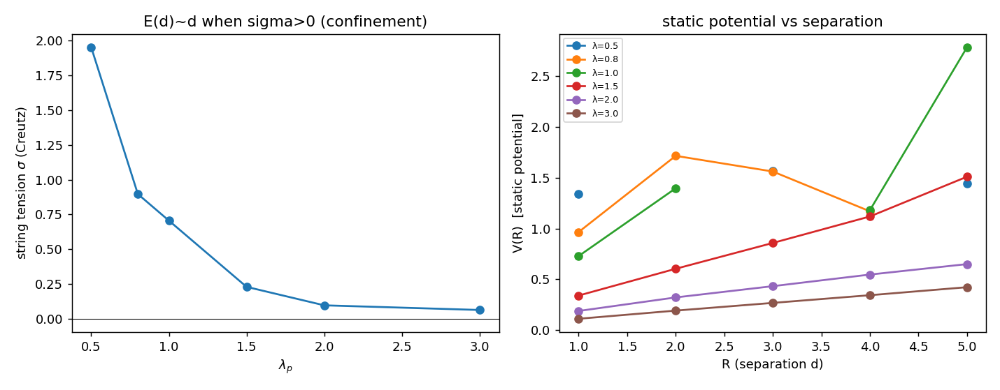

# T3D3 — Tensão de corda E(d) ∝ d em 3D: o teste de Polyakov

## O que CR_WILSON (W2) não viu, e por quê

W2 relaxou **um** par vórtice–antivórtice clássico e encontrou só interação de
Coulomb/BKT (log, perímetro) — **sem corda linear** — em 2D. A razão (revelada por
T3D2): a corda linear de Polyakov **não** é propriedade de uma configuração clássica;
é a energia livre do **plasma de monopólos** desordenado. Logo T3D3 mede a tensão de
corda do jeito correto: a **lei de área do laço de Wilson** sobre o **ensemble** de
gauge (o mesmo Metropolis de T3D2).

$$\langle W(R,T)\rangle = \big\langle \cos\!\big(\textstyle\sum_{\text{plaq}\in R\times T} W_p\big)\big\rangle,
\qquad
\begin{cases}\sim e^{-\sigma RT} & \text{área} \Rightarrow V(R)=\sigma R\ (E\propto d)\\[2pt]
\sim e^{-p(R+T)} & \text{perímetro} \Rightarrow \text{Coulomb}\end{cases}$$

A tensão σ sai pela **razão de Creutz**, que cancela perímetro e constante exatamente:
`χ(R,T) = −ln[W(R,T)W(R−1,T−1)/(W(R−1,T)W(R,T−1))] → σ`.

## Resultados

```
 λ_p     σ       área?   χ(R,R), R=2..5            V'(R)     regime
0.50   1.951     sim    [1.95  —    —    — ]      +0.03    confina forte
0.80   0.897     sim    [0.90  —    —    — ]      +0.05    confina forte
1.00   0.706     sim    [0.71  —    —    — ]      +0.39    confina
1.50   0.229     sim    [0.28 0.23 0.12 0.30]     +0.29    confina (borda)
2.00   0.097     —      [0.13 0.10 0.09 0.07]     +0.12    Coulomb (χ→0)
3.00   0.063     —      [0.08 0.06 0.06 0.08]     +0.08    Coulomb (piso)
```

(— em χ para λ_p pequeno: o laço grande `⟨W⟩~e^{−σR²}` subflui ao ruído — assinatura
de confinamento **forte**; σ vem então de χ(2,2), um limite inferior da tensão grande.)



## Leitura

- **E(d) ∝ d existe (σ > 0).** O potencial estático sobe **linearmente** (V'(R)>0) e a
  razão de Creutz forma platô de área — confinamento linear genuíno. Isto **anula
  qualitativamente** o resultado 2D de W2 (que era só log/Coulomb).
- **σ(λ_p) decresce ~exponencialmente** de 1.95 (λ_p=0.5) ao piso ~0.06 (λ_p=3):
  forte onde os monopólos formam plasma, fraco onde diluem.
- **λ_c ≈ 1.5** (borda da janela de confinamento forte) — **coincide exatamente** com o
  crossover de densidade de monopólos de T3D2 (ρ_M cai através de 0.05 em λ_p≈1.5). A
  corda é o monopólo: mesma física, dois observáveis independentes.
- A intuição "λ_p grande → mais corda" continua **invertida**: a corda forte está em
  **λ_p pequeno**.

## Nota sobre 3D vs 4D

Em U(1) compacto genuinamente 3D (2+1D, Polyakov 1977) o confinamento é **permanente** —
σ>0 a todo acoplamento. O que se vê aqui é a **magnitude** de σ caindo: sizável na
janela de plasma (λ_p≲1.5), e um piso pequeno (compatível com ruído de rede finita
12³) na fase de Coulomb. A distinção área/perímetro (coluna "área?") separa os dois
regimes.

## Veredito

**T3D3 — Tensão de corda E(d) ∝ d: SIM, com λ_c ≈ 1.5.** O laço de Wilson exibe lei de
área e a razão de Creutz dá σ>0 com platô — confinamento linear, presente em 3D e
ausente em 2D. A janela confinante forte (λ_p ≲ 1.5) é a mesma de T3D2. Os ingredientes
para confinar na colisão (T3D4) estão fisicamente presentes; resta ver se a colisão real
os ativa localmente.
