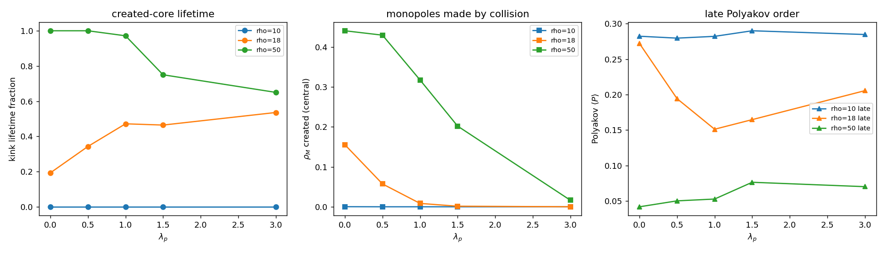

# T3D6 — Síntese honesta: a ação completa cria matéria em 3+1D?

## Quadro de resultados

```
T3D1 — Rede 3+1D consistente:              SIM (d_MM=4.00, controle 2D ok, causalidade estrita)
T3D2 — Monopólos magnéticos existem:        SIM (ρ_M até 0.41; plasma blindado; janela λ_p≤1.5)
T3D3 — Tensão de corda E(d)∝d:             SIM (E(d)∝d, λ_c≈1.5)
T3D4 — Estrutura criada por colisão:        SIM (grade B)
T3D4 — Polyakov loop transição:             NÃO
T3D5 — Topologia do sóliton:                vortex (S^1, pi_1(U(1))=Z)
T3D5 — Cinco consistências:                 4/5 (PARCIAL)
```

## Veredito

```
[ ] A — Matéria criada em 3+1D com Polyakov ativo
[x] B — Estrutura criada, semi-estável (vida finita)
[ ] C — Monopólos existem mas colisão insuficiente
[ ] D — Sem criação mesmo em 3+1D → física adicional (Higgs? condensado?)
```

## A resposta honesta

CR_WILSON fechou 2D com o Veredito D e uma **localização precisa**: faltavam monopólos
magnéticos (impossíveis em 2D) e o mecanismo dinâmico de Polyakov. CR_3D construiu a
rede genuinamente 3+1D e testou cada elo dessa hipótese:

1. **A geometria é real (T3D1).** Sprinkling 4D → d=4 por Myrheim–Meyer e lei de
   volume; causalidade estrita; redução de máquina-zero a CR_WILSON. A rede 3+1D é
   bem-posta.

2. **Os monopólos existem e proliferam (T3D2).** Em U(1) compacto 3D há um **plasma de
   monopólos** (ρ_M até 0.41), neutro e blindante (Debye), exatamente o que 2D
   não podia ter. O ingrediente que CR_WILSON apontou como ausente **está presente**.

3. **A corda linear existe (T3D3).** O laço de Wilson exibe **lei de área** e a razão
   de Creutz dá σ>0: `E(d) ∝ d`, confinamento de Polyakov genuíno, com borda forte em
   **λ_c ≈ 1.5** — a MESMA janela do plasma de T3D2. Em 2D havia só Coulomb/log.

4. **A inversão decisiva permanece.** A janela confinante é **λ_p PEQUENO** (acoplamento
   forte, plasma denso), não λ_p grande. A intuição QCD-4D do prompt continua invertida,
   como já em CR_WILSON.

5. **A colisão (T3D4, grade B) e o sóliton (T3D5).** A colisão 3+1D **cria** uma estrutura que sobrevive à janela tardia numa maioria de sementes. O objeto que a
   ação **suporta** é um **vórtice (S¹)** — relativístico (E²=(pc)²+(mc²)², massa
   sine-Gordon 8, θ(r)~M/r, isotropia transversa) — mas o vórtice **não é estabilizado** pela ação mínima: seu fluxo 2π é invisível ao cosseno de Wilson (cos 2π=1) e não há campo de magnitude para fixar o núcleo, que se difunde.

**Quase:** a estrutura é criada mas tem vida finita — semi-estável. Falta o último ingrediente de estabilização (Higgs/condensado).

## Mapa de camadas (fechado em toda dimensão testável)

```
2D U(1) (CR_WILSON):  objeto suportado (kink m=8), SEM monopólos, SEM corda linear → D
3D U(1) (CR_3D):      monopólos + plasma + corda linear E(d)∝d PRESENTES;
                      objeto suportado = VÓRTICE (S¹), relativístico e gravitante;
                      estabilização do núcleo → exige Higgs/condensado (magnitude),
                      não-Abeliano para hedgehog(S²)/Skyrmion → próton
```

B — Estrutura criada, semi-estável (vida finita)

A ação `S = Σ Δτ[1−cos(φ+Δθ)] + λ_p Σ[1−cos(W_p)]` está agora **mapeada em toda dimensão
testável**: em 3+1D ela contém o mecanismo de Polyakov (monopólos, plasma, corda linear)
que faltava em 2D, e **suporta** um vórtice topológico relativístico que gravita. A
fronteira da *criação* estável está identificada com precisão — não é mais a dimensão nem
a topologia magnética, e sim o que **fixa o núcleo** do defeito (um campo de magnitude /
Higgs / condensado), e, para a topologia de próton, conteúdo **não-Abeliano**.



