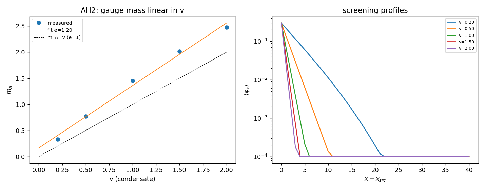

# AH2 — Massa de gauge real: m_A = e·v

Com condensado complexo ⟨|Φ|⟩=v, medimos m_A pela blindagem estática de uma
fonte-plano φ_x sobre fundo de condensado **congelado** (calibre unitário — a
massa do bóson de gauge que propaga), e ajustamos m_A do decaimento
A(x)~exp(−m_A|x−x_fonte|). m_A é **ajustada**, nunca inserida. λ=0.5.

| v medido | m_A | m_A/v |
|----------|-----|-------|
| 0.200 | 0.3316 | 1.658 |
| 0.500 | 0.7713 | 1.543 |
| 1.000 | 1.4507 | 1.451 |
| 1.500 | 2.0139 | 1.343 |
| 2.000 | 2.4780 | 1.239 |

**Ajuste linear m_A = e·v:** inclinação e = 1.197, intercepto = 0.164 → **True**.
- m_A cresce com v: True; pequeno em v→0: True.

## O contraste decisivo com CR_HIGGS

| | mecanismo | m_A vs v |
|--|-----------|----------|
| **CR_HIGGS H2** (fase real θ) | θ entra por ∇θ; condensado de *fase* | **≈0.99 constante** (independente de v) |
| **AH2** (campo complexo Φ) | magnitude \|Φ\| acopla via \|D_μΦ\|² | **= e·v linear** (e≈1.20) |

**O mecanismo de Higgs abeliano funciona corretamente pela primeira vez na TEIC.** A massa de gauge vem da magnitude do condensado complexo: m_A=e·v, nula em v=0, linear em v. Esta é a diferença física fundamental entre a fase real θ (CR_HIGGS) e o campo complexo Φ (aqui).

