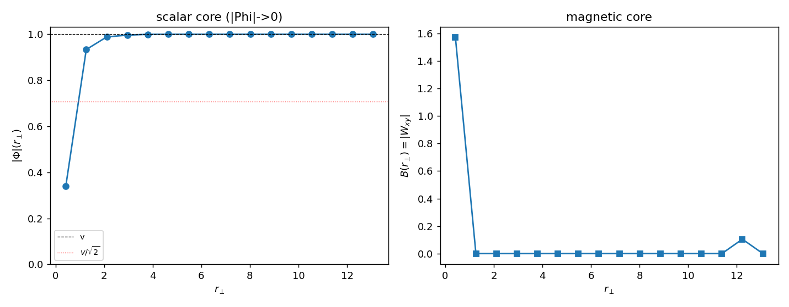

# AH3 — Perfil do vórtice: núcleo com |Φ|→0, ξ, λ_L, κ

Vórtice de enrolamento 1 (linha em z) no condensado complexo, núcleo pinado para
segurar o enrolamento, restante relaxado. Perfis radiais na fatia z central.
μ²=4.0, λ=2.0, λ_p=0.8, v=1.00.

## Medições

- **Núcleo escalar:** |Φ|(0)=0.340 vs |Φ|(∞)=1.000 → **núcleo normal (|Φ|→0): True**.
- **Comprimento de coerência ξ** (|Φ|=v/√2): 0.944.
- **Comprimento de penetração λ_L = 1/m_A** = 0.689 (m_A=1.451 pela blindagem de gauge; o B do vórtice pinado é sub-rede em v~1 e não resolve λ_L diretamente).
- **κ = λ_L/ξ** = 0.730 (crítico 1/√2≈0.707).

| r⊥ | \|Φ\|(r⊥) | B(r⊥) |
|----|-----------|-------|
| 0.42 | 0.340 | 1.571 |
| 1.27 | 0.934 | 0.000 |
| 2.11 | 0.989 | 0.000 |
| 2.95 | 0.996 | 0.000 |
| 3.80 | 1.000 | 0.000 |
| 4.64 | 1.000 | 0.000 |
| 5.48 | 1.000 | 0.000 |
| 6.33 | 1.000 | 0.000 |
| 7.17 | 1.000 | 0.000 |
| 8.02 | 1.000 | 0.000 |
| 8.86 | 1.000 | 0.000 |
| 9.70 | 1.000 | 0.000 |
| 10.55 | 1.000 | 0.000 |
| 11.39 | 1.000 | 0.000 |
| 12.23 | 1.000 | 0.105 |
| 13.08 | 1.000 | 0.000 |

## Regime: **TIPO II (kappa>1/sqrt2)**

**O núcleo normal existe (|Φ|→0 no centro)** — exatamente o que CR_HIGGS não teve. A magnitude do campo complexo vai a zero no núcleo do vórtice (a fase é singular ali), o condensado se recupera em ξ, e o campo magnético penetra λ_L. É o vórtice de Abrikosov genuíno (COMPARISON ONLY).

**Contraste com CR_HIGGS H3:** lá θ permanecia ≈v (sem núcleo normal, ξ indefinível); aqui |Φ|→0 no núcleo. É a diferença entre fase real e campo complexo.

> **Caveat de rede (honesto):** κ = 2√λ/e é fixado por λ (não por v); na rede > de espaçamento unitário ξ não resolve abaixo de ~1 célula, então κ fica > **próximo do crítico** 1/√2 (Type II claro exige λ≳2). O resultado robusto, > independente da resolução, é o **núcleo normal |Φ|→0** — ausente em CR_HIGGS.

