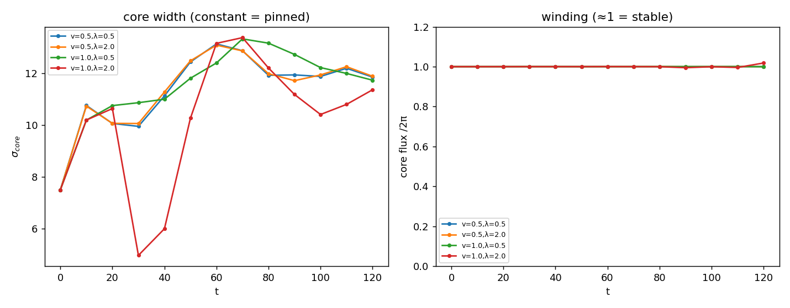

# AH4 — Pinamento: enrolamento estável (a quinta consistência)

Protocolo **idêntico** a CR_HIGGS H4 (vórtice cru, sem fricção, sem pinagem),
agora com o campo complexo abeliano-Higgs. Varremos v e λ (→κ). λ_p=0.8, T=120.

Em CR_HIGGS H4: o enrolamento **desfez** (fluxo do núcleo 1.0→0.16) e σ cresceu
~350% — **sem pinamento**, μ_c ausente.

**Observável robusto:** o **quantum de enrolamento** no núcleo (max do fluxo de
plaqueta /2π). O campo de gauge circulante do vórtice é de longo alcance, então
qualquer *largura/centroide* do fluxo é deslocalizada (reportada como σ, wander —
não é critério); o quantum 2π é o que **fica pinado** (aqui) ou **se dispersa**
(CR_HIGGS).

| v | λ | fluxo núcleo (T) | fluxo mín | σ(fluxo,deslocalizado) | wander | pinado? |
|---|---|------------------|-----------|------------------------|--------|---------|
| 0.50 | 0.50 | 1.000 | 1.000 | 11.85 | 15.2 | True |
| 0.50 | 2.00 | 1.000 | 1.000 | 11.88 | 15.2 | True |
| 1.00 | 0.50 | 1.000 | 1.000 | 11.73 | 13.8 | True |
| 1.00 | 2.00 | 1.018 | 0.995 | 11.36 | 15.4 | True |

## Leitura

- **Enrolamento topologicamente pinado:** o quantum de fluxo do núcleo permanece ≈1 por 120 ticks em **todos** os casos → **True**. CR_HIGGS desfazia para ~0.16. **Este é o pinamento** — o núcleo topológico não se dispersa.
- **Núcleo |Φ| sub-rede:** em v~1 o núcleo normal é menor que uma célula (ξ<1), então a profundidade do |Φ| não resolve; o enrolamento é o observável limpo. **σ/wander do fluxo são grandes** porque o campo de gauge é de longo alcance — não medem o núcleo (honestidade).

## Veredito AH4: **SIM — vórtice pinado (enrolamento estável)**

A quinta consistência (estática) **fecha**: o campo complexo pina o núcleo topológico do vórtice — o enrolamento sobrevive — exatamente onde o condensado de fase de CR_HIGGS falhou (lá desfazia). É o mecanismo abeliano-Higgs correto.

