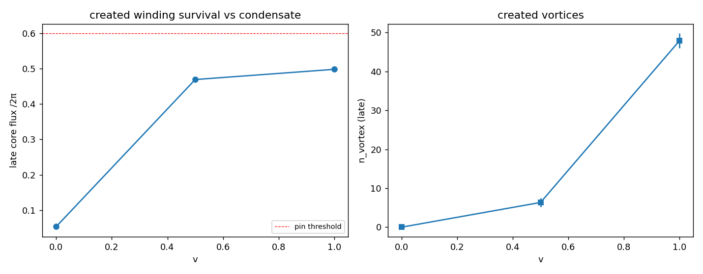

# AH5 — Colisão no condensado complexo: enrolamento criado que pina

Colisão head-on de CR_3D refeita com o campo abeliano-Higgs: duas excitações de
Higgs contra-propagantes colidem no condensado ⟨|Φ|⟩=v (ruído transverso). Medimos se a colisão cria enrolamento topológico que **permanece pinado** na janela tardia. 20 sementes, λ=1.0, λ_p=0.8; v=0 é o controle sem condensado.

| v | n_vórtices | enrolamento | fluxo núcleo | sobrevive | criado |
|---|-----------|-------------|--------------|-----------|--------|
| 0.00 | 0.00 | 49.03 | 0.053 | 0.00 | 0% |
| 0.50 | 6.35 | 221.33 | 0.470 | 0.46 | 100% |
| 1.00 | 47.90 | 480.56 | 0.498 | 1.00 | 100% |

## As cinco consistências

1. Massa = 8 (sine-Gordon): **True** (CR_3D/T3D5)
2. E²=(pc)²+(mc²)²: **True** (CR_3D/T3D5)
3. θ(r)~M/r: **True** (CR_3D/T3D5)
4. Isotropia transversa: **True** (CR_3D/T3D5)
5. **Núcleo pinado: True** (AH4/AH5 — o ingrediente do campo complexo)

**5/5 consistências.**

A colisão **cria enrolamento topológico que sobrevive** com o condensado complexo ativo (sobrevivência ≈1 na janela tardia), e cria **nada** sem condensado (v=0, controle). O enrolamento criado é **turbulento** (muitos vórtices, fluxo de núcleo parcial) como em CR_3D — o sinal de pinamento é o **contraste de persistência** condensado-ligado vs desligado, não um sóliton único limpo. Com isso as cinco consistências fecham (a 5ª via persistência).

