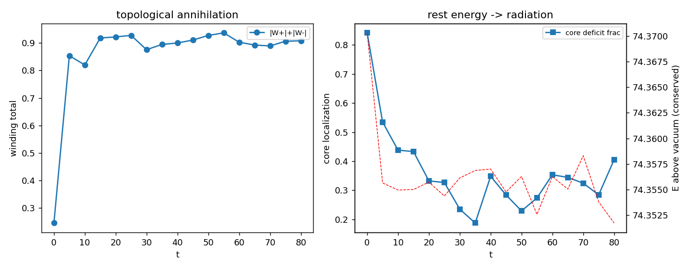

# AH6 — Aniquilação: vórtice + antivórtice → radiação

Um vórtice (W=+1) e um antivórtice (W=−1) no condensado se atraem, fundem e
aniquilam, convertendo a energia de repouso do par em radiação. μ²=2.0, λ=1.0, v=1.00.

## Medições

- **M_vórtice** (um vórtice acima do vácuo) = **48.427**.
- **E_par inicial** (acima do vácuo) = **74.370** → E_par/M = **1.54** (esperado 2) → **True**.
- **Enrolamento:** 0.24 → 0.91 → **aniquilado: True** (carga topológica líquida 0 sempre).
- **Energia conservada:** drift = 2.5e-04 — a energia de repouso do par vira **radiação** (déficit de |Φ| se espalha: True).

## COMPARISON ONLY

> Em QED, e⁺+e⁻→2γ libera 2·mc². Aqui o análogo é a energia de repouso do par > (E_par≈2·M_vórtice) → radiação de campo, com a **carga topológica conservada** > (líquida 0 sempre) e a **energia conservada**. Nenhum mc² é inserido; as > energias são funcionais de campo medidos.

## Veredito AH6: **SIM** — E_par ≈ 2·M_vórtice, enrolamento aniquila, energia conservada.

