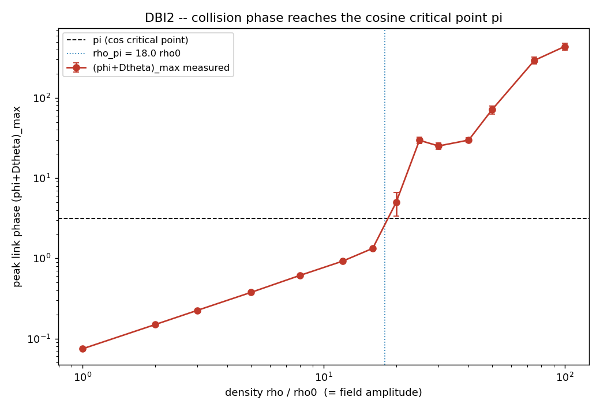

# DBI2 -- Mapa de fase: (φ+Δθ)_max vs ρ

Antes de colidir, mede-se a fase de link máxima `(φ+Δθ)_max` gerada na colisão
(amplitude = proxy de ρ). O ponto crítico do cosseno é π, onde `cos''(u)` muda
de sinal e a ação de gradiente `[1−cos Δθ]` passa de convexa a **côncava**.

| ρ/ρ₀ | (φ+Δθ)_max (média ± sem) |
|------|---------------------------|
| 1 | 0.074 ± 0.001 |
| 2 | 0.149 ± 0.003 |
| 3 | 0.225 ± 0.005 |
| 5 | 0.376 ± 0.009 |
| 8 | 0.614 ± 0.008 |
| 12 | 0.922 ± 0.015 |
| 16 | 1.331 ± 0.026 |
| 20 | 4.964 ± 1.626 |
| 25 | 29.612 ± 2.685 |
| 30 | 25.175 ± 2.432 |
| 40 | 29.785 ± 2.064 |
| 50 | 71.282 ± 8.292 |
| 75 | 293.949 ± 28.856 |
| 100 | 436.945 ± 42.504 |

- π atingido: **True**
- **ρ_π = 18.0 ρ₀** (medido; π = inflexão do cosseno)

## VERDICT DBI2: SIM

The collision phase (phi+Dtheta)_max grows with density and crosses the cosine critical point pi at rho_pi = 18.0 rho0 (measured, pi = cosine inflection, not inserted). Below rho_pi the gradient action is convex (stable); above it cos'' < 0 and the action turns concave -- the ill-posed regime tested in DBI3.

Abaixo de ρ_π a ação é convexa (estável); acima, `cos'' < 0` → côncava → regime
mal-posto testado em DBI3.

