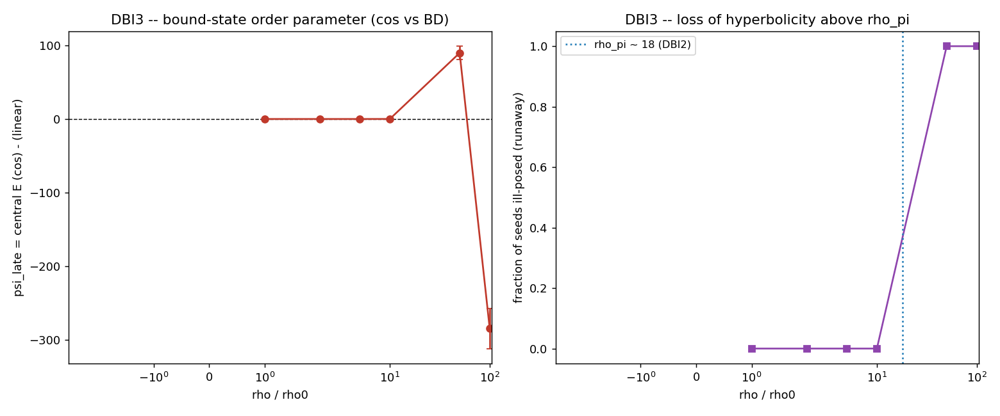

# DBI3 -- Colisão com dinâmica cos completa

Mesma colisão de CR3, mas evoluída com a força cos (sine-Gordon) em vez da BD
linear. Por densidade ρ (= amplitude), 20 sementes:

| ρ/ρ₀ | ψ_tardio (cos − linear) | W (winding) | fração mal-posta |
|------|--------------------------|-------------|-------------------|
| 1 | -0.000 ± 0.000 | -0.000 | 0% |
| 2 | -0.000 ± 0.000 | -0.001 | 0% |
| 5 | -0.003 ± 0.007 | -0.001 | 0% |
| 10 | +0.050 ± 0.073 | -0.003 | 0% |
| 50 | +89.611 ± 9.174 | -0.013 | 100% |
| 100 | -284.285 ± 27.166 | -0.027 | 100% |

- **Controle compacto** (sine-Gordon, campo S¹): um kink explícito é detectado (1) e **estável** (1 após T); uma colisão forte nuclea um par kink-antikink acima de amp~8 (transiente, ver DBI4) → a criação é possível **se o campo for compacto**.
- **Proxy oblíquo** (ρ=10, vfrac=0.5): ψ_tardio = -0.025 ± 0.053.

## VERDICT DBI3: cenário 3 + 4 (grade D)

The scalar (density) cos sector does NOT create matter. Below rho_pi the cos collision is an essentially exact pass-through (psi_late ~ 0, W = 0): the gradient nonlinearity only softens the overlap, no bound structure and no winding -- extending CR3's null into the non-linear-but-subcritical regime. Above rho_pi (cos'' < 0) the evolution LOSES HYPERBOLICITY and runs away (ill-posed in up to 100% of seeds), a breakdown of the action, NOT controlled creation (Scenario 4). Winding is structurally absent because the density field is non-compact (single-valued); the SAME dynamics on a COMPACT field (sine-Gordon) supports a STABLE kink (detector validated) and nucleates a persistent kink-antikink pair above amp~8 -- so the creation mechanism exists ONLY in the compact gauge sector (A_mu), the next layer (Scenario 3).

### Honestidade

W = ∮Δθ é **estruturalmente 0** para o campo de densidade (não-compacto, valor
único): a fase do gradiente não enrola. O mesmo cosseno num campo **compacto**
(S¹) nuclea kinks — logo o winding/criação vive no setor de gauge compacto
(A_μ), a próxima camada. Acima de ρ_π, `cos'' < 0` → perda de hiperbolicidade
(fuga não-convergente), uma quebra da ação, não criação controlada.

