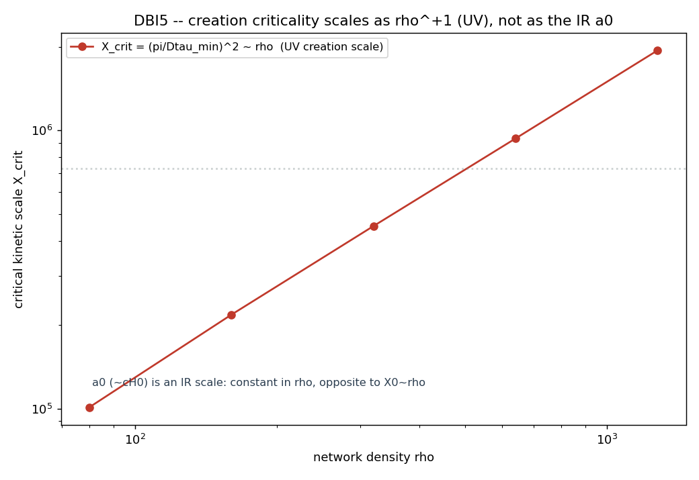

# DBI5 -- ρ_DBI vs ρ(a₀): saturação UV ou a₀ cosmológico?

A esperança: a saturação DBI ocorre quando X = (Δθ/Δτ)² atinge X₀ = a₀² (DEV);
se ρ_DBI = ρ(a₀), então a aceleração crítica galáctica a₀ **seria** o limiar de
criação de matéria — uma escala unificando curvas de rotação, criação de pares
e saturação da ação.

O que a rede diz (lendo C3, único lugar onde a₀/DEV entra — anti-circularidade):

- `Δτ_min ~ ρ^(-0.55)` (sliver do cone de luz) →
  `X₀ ~ ρ^(+1.10)` (UV/granularidade).
- Criticalidade DBI2: `ρ_π = 18.0 ρ₀`; lá Δθ ~ π, logo
  `X_crit = (π/Δτ_min)² ~ ρ^(+1.06)` — **mesma escala UV** que X₀.

## VERDICT DBI5: NAO / ABERTO

rho_DBI is a UV (granularity) scale, NOT the cosmological a0. The creation/saturation criticality sits at X_crit = (pi/Dtau_min)^2 ~ rho^(1.06), the SAME rho^+1 UV scaling as the DBI saturation scale X0 (C3: X0 ~ rho^1.10, from Dtau_min ~ rho^-0.55 light-cone sliver). a0 ~ 1.2e-10 m/s^2 is an IR / cosmological scale (~ c H0); equating X0 = a0^2 fixes rho to a Planck-granularity value unrelated to rho_pi. So the hoped unification rho_DBI = rho(a0) does NOT hold: matter-creation criticality (UV) and the galactic a0 (IR) are different scales. This reproduces C3/W4 ('X0 ~ rho is UV, not cH') from the creation side. The IR scale a0 must come from elsewhere (the next layer: BD non-locality / the A_mu sector), not from the scalar DBI saturation.

