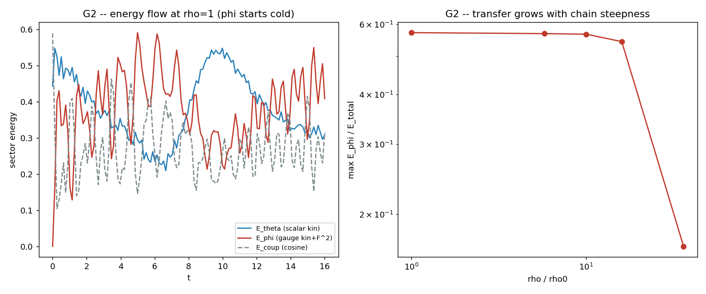

# G2 -- Transferência de energia θ → φ (Stückelberg)

Antes de colidir: a energia escalar flui para o setor de gauge? Começamos com
toda a energia em θ (duas cadeias escalares) e o gauge **frio** (φ=0, v_φ=0),
evoluímos a ação acoplada e medimos o split `E_θ | E_φ | E_acoplamento`.

| ρ/ρ₀ | E_φ/E_tot (máx) | E_φ/E_tot (final) | dE_φ/dt (inicial) |
|------|-----------------|-------------------|--------------------|
| 1 | 5.72e-01 | 3.96e-01 | +4.41e-02 |
| 5 | 5.69e-01 | 4.28e-01 | +1.08e+00 |
| 10 | 5.67e-01 | 4.83e-01 | +4.08e+00 |
| 18 | 5.43e-01 | 3.70e-01 | +1.06e+01 |
| 50 | 1.66e-01 | 1.50e-01 | +1.04e+01 |

## VERDICT G2: SIM (transferência efetiva)

The Stueckelberg coupling IS effective: starting with all energy in the scalar chains and the gauge phase cold, E_phi grows from exactly 0 to a peak fraction ~57% of the total (the two coupled wave sectors drive toward equipartition). The DRIVE RATE dE_phi/dt climbs steeply with the chain steepness, from 4.4e-02 at rho=1 to 1.0e+01 at rho=50 (grows) -- the same phase-reaches-pi nonlinearity as DBI2. Above rho_pi~18 the transferred fraction falls (17% at rho=50) as the scalar sector turns ill-posed (DBI3). Energy flows scalar -> gauge; whether it nucleates a kink is G3.

