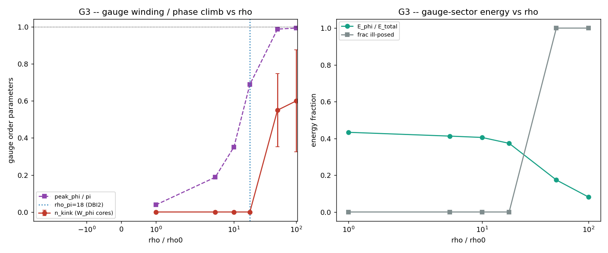

# G3 -- Colisão head-on com dinâmica acoplada (teste central)

Duas cadeias escalares (θ alto, gauge frio φ=0) colidem head-on sob a ação
completa acoplada. G2 mostrou que a energia flui θ→φ; G3 pergunta se esse fluxo
**nucleia** um objeto topológico no setor de gauge compacto. Por ρ, 20 sementes:

| ρ/ρ₀ | n_kink | W_φ | peak_φ | E_φ/E_tot | frac par | frac mal-posto |
|------|--------|-----|--------|-----------|----------|-----------------|
| 1 | 0.00±0.00 | -0.000 | 0.12 | 0.43 | 0% | 0% |
| 5 | 0.00±0.00 | -0.000 | 0.59 | 0.41 | 0% | 0% |
| 10 | 0.00±0.00 | +0.000 | 1.10 | 0.41 | 0% | 0% |
| 18 | 0.00±0.00 | +0.000 | 2.16 | 0.37 | 0% | 0% |
| 50 | 0.55±0.20 | +0.000 | 3.10 | 0.17 | 15% | 100% |
| 100 | 0.60±0.28 | +0.000 | 3.12 | 0.08 | 15% | 100% |

- **Limiar ρ_gauge:** não existe (comparar com ρ_π = 18ρ₀ de DBI2).
- **Varredura razão de energia** E_θ/E_φ (ρ=18, n_kink médio): {'inf': 0.0, '10': 0.0, '1': 0.0, '0.1': 0.0}.
- **Ângulo:** head-on = 0.00, oblíquo (vfrac=0.5) = 0.00 kinks.
- **Fase inicial φ₀:** {'0': 0.0, 'pi/4': 0.0, 'pi/2': 0.0}.

## VERDICT G3: cenário 2/3 (nucleação MARGINAL só no regime mal-posto) (grade C)

Marginal creation only. Energy DOES flow scalar->gauge (G2), and the gauge phase climbs monotonically with rho (peak_phi 0.1 -> ~pi), but it reaches pi ONLY at rho >= 50 -- the SAME densities where the scalar sector itself runs away (peak_theta >> amp, the DBI3 cos''<0 ill-posedness above rho_pi=18). There a kink-antikink pair nucleates in ~15% of seeds (net W_phi~0, charge conserved), but in the UNCONTROLLED regime, so it is not clean creation. In the controlled regime (rho <= 18) the gauge phase stays below pi and NOTHING is created. The Stueckelberg drag transfers energy but it ends as gauge RADIATION, not a trapped kink, until the scalar breaks down -- Scenario 3 refined: transfer is real (Scenario 4 excluded), yet stable matter still needs more structure (plaquette/Wilson dynamics or an external field).

