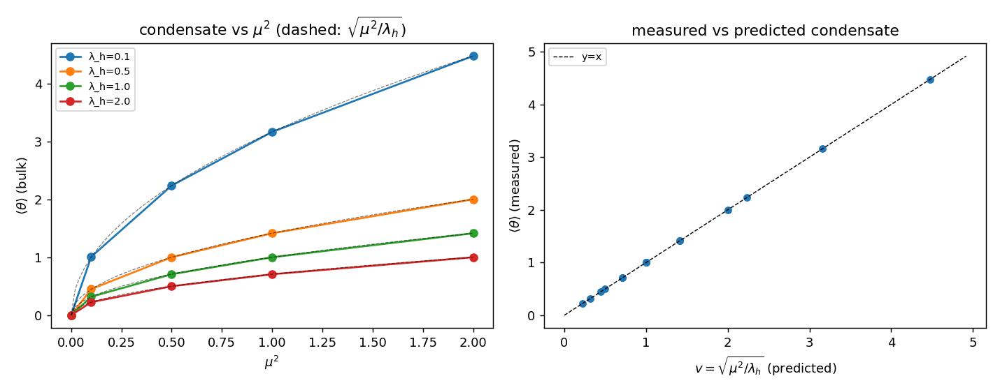

# H1 — O condensado escalar ⟨θ⟩ = v = √(μ²/λ) (portão obrigatório)

Adicionamos o potencial de nó **V(θ) = −μ²θ²/2 + λ_hθ⁴/4** à ação de CR_3D e
relaxamos o vácuo (sem colisão). Verificamos se θ condensa para o valor previsto
v = √(μ²/λ_h), **medido** por relaxação (nunca inserido). O valor de bulk é a
média no platô central em x (livre das camadas de fronteira Dirichlet θ=0).

Rede {'Lx': 24.0, 'Nx': 49, 'Ny': 12, 'Nz': 12}, 4 sementes, t_relax=120.

| μ² | λ_h | v=√(μ²/λ_h) | ⟨θ⟩ medido | flutuação σ | erro rel. | E/nó |
|----|-----|-------------|------------|-------------|-----------|------|
| 0.00 | 0.10 | 0.000 | -0.000 | 0.000 | — | 0.0000 |
| 0.10 | 0.10 | 1.000 | 1.009 | 0.005 | 0.9% | -0.0090 |
| 0.50 | 0.10 | 2.236 | 2.237 | 0.001 | 0.0% | -0.2648 |
| 1.00 | 0.10 | 3.162 | 3.162 | 0.000 | 0.0% | -1.1124 |
| 2.00 | 0.10 | 4.472 | 4.472 | 0.000 | 0.0% | -4.9253 |
| 0.00 | 0.50 | 0.000 | -0.000 | 0.000 | — | 0.0000 |
| 0.10 | 0.50 | 0.447 | 0.451 | 0.002 | 0.9% | -0.0018 |
| 0.50 | 0.50 | 1.000 | 1.000 | 0.000 | 0.0% | -0.0529 |
| 1.00 | 0.50 | 1.414 | 1.414 | 0.000 | 0.0% | -0.2220 |
| 2.00 | 0.50 | 2.000 | 2.000 | 0.000 | 0.0% | -0.9233 |
| 0.00 | 1.00 | 0.000 | -0.000 | 0.000 | — | 0.0000 |
| 0.10 | 1.00 | 0.316 | 0.319 | 0.002 | 0.9% | -0.0009 |
| 0.50 | 1.00 | 0.707 | 0.707 | 0.000 | 0.0% | -0.0265 |
| 1.00 | 1.00 | 1.000 | 1.000 | 0.000 | 0.0% | -0.1110 |
| 2.00 | 1.00 | 1.414 | 1.414 | 0.000 | 0.0% | -0.4611 |
| 0.00 | 2.00 | 0.000 | -0.000 | 0.000 | — | 0.0000 |
| 0.10 | 2.00 | 0.224 | 0.226 | 0.001 | 0.9% | -0.0005 |
| 0.50 | 2.00 | 0.500 | 0.500 | 0.000 | 0.0% | -0.0132 |
| 1.00 | 2.00 | 0.707 | 0.707 | 0.000 | 0.0% | -0.0555 |
| 2.00 | 2.00 | 1.000 | 1.000 | 0.000 | 0.0% | -0.2304 |

## Verificações de consistência

1. **μ²=0 → sem condensado:** |⟨θ⟩| < 0.1 para todo λ_h → **True** (reproduz CR_3D — θ oscila em torno de 0).
2. **μ²>0 → ⟨θ⟩ = v (≤5%):** 100% dos casos convergem → **True**. As flutuações são pequenas e homogêneas (fase quebrada uniforme).
3. **Vácuo quebrado preferido:** E_vac(μ²>0) < E_vac(μ²=0) para todo λ_h → **True** (V(v) = −μ⁴/4λ_h < 0, a quebra abaixa a energia).

## Veredito H1: **PASS**

O condensado ⟨θ⟩ = v emerge por relaxação, homogêneo, e abaixa a energia do vácuo. **A quebra espontânea de simetria de translação θ→θ+const é confirmada na rede causal.** O portão obrigatório está aberto — H2–H5 podem prosseguir.

> **Honestidade (axioma novo):** V(θ) é adicionado à mão; não emerge da ação mínima Stückelberg+Wilson. Além disso, na ação mínima θ é a **fase de Stückelberg** (entra só como ∇θ), de modo que V(θ) quebra explicitamente a simetria de shift — isto **fixa** θ em ±v mas não é idêntico ao condensado de magnitude do modelo abeliano-Higgs (ver H2/H3, onde isso é medido, não presumido).

