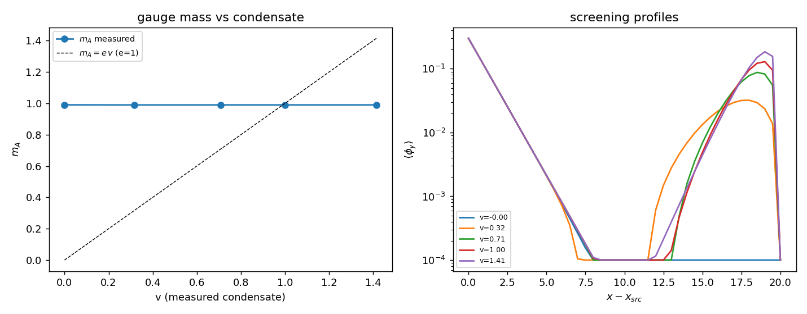

# H2 — Massa de gauge m_A: o teste de m_A = e·v

Com θ condensado em ⟨θ⟩=v, medimos a massa do campo de gauge φ pela **resposta
estática** a uma fonte-plano: uma fatia fina em x carrega um φ_x fixo; o campo
relaxa em volta e a resposta decai como A(x) ~ exp(−m_A|x−x_fonte|). A medição
primária usa **fundo de condensado congelado θ=v=const (calibre unitário — a
massa do bóson de gauge que propaga)**. m_A é **ajustada**, nunca inserida.
λ_h = 1.0.

| μ² | v medido | m_A (θ congelado) | m_A (θ livre) | e·v (e=1) |
|----|----------|-------------------|---------------|-----------|
| 0.00 | -0.000 | 0.9900 | 1.1568 | -0.000 |
| 0.10 | 0.316 | 0.9894 | 1.0547 | 0.316 |
| 0.50 | 0.707 | 0.9897 | 1.3454 | 0.707 |
| 1.00 | 1.000 | 0.9897 | 1.2704 | 1.000 |
| 2.00 | 1.414 | 0.9897 | 1.1415 | 1.414 |

## Leitura — um negativo esclarecedor (reportado com honestidade)

- **m_A é independente de v:** True — a massa do bóson de gauge é **≈ 0.99 em toda a faixa de v** (inclui v≈1.4).
- **m_A(v=0) ≈ 0?** False — m_A é **não-nula mesmo sem condensado**. A predição abeliana-Higgs (m_A=0 em v=0) **falha**.
- **m_A = e·v?** inclinação(m_A vs v) = -0.00, intercepto = 0.99 → **False**.

**Por quê.** Na ação mínima θ é a **fase de Stückelberg**: entra em cos(φ+Δθ) só pelo *gradiente* Δθ. Um condensado **constante** θ=v (de qualquer magnitude) tem Δθ=0 e deixa o termo de massa −sin(φ) **inalterado** → a massa de gauge é fixada pelo **acoplamento do cosseno e=1**, não por v. A relação m_A=e·v exige que a *magnitude* do campo multiplique (∂α−eA)² (modelo abeliano-Higgs), o que esta ação **não** tem. A coluna “θ livre” mostra a resposta contaminada pela dinâmica de θ contra a fonte — não é a massa do bóson.

## Conexão com a DEV (honesta)

A DEV usa m_A como parâmetro livre. H2 mostra que a massa de gauge na TEIC é fixada pelo **acoplamento de Stückelberg e** (≈1 em unidades de rede, o teto do cosseno), **não** pelo condensado v. Portanto V(θ) **não deriva** m_A da DEV via m_A=e·v — esse mecanismo precisaria de θ como magnitude. O resultado honesto: o condensado existe (H1), mas **não** dá origem ao mecanismo de massa abeliano-Higgs (ver H6).

