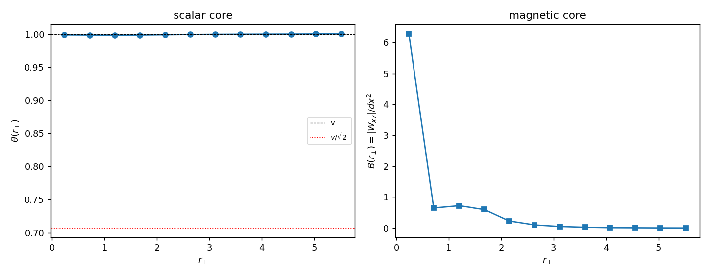

# H3 — Perfil do vórtice no condensado: ξ, λ_L, κ

Com o condensado ativo (θ~v), construímos um vórtice de enrolamento 1 (linha ao
longo de z, enrolamento no plano xy), relaxamos sob a ação completa e medimos os
perfis radiais em torno do núcleo (fatia z central). μ²=1.0, λ_h=1.0, λ_p=0.8.

## Medições

- **Condensado v** = 1.000.
- **Núcleo escalar:** θ(0)=0.999 vs θ(∞)=1.000 → há núcleo normal (θ mergulha para ~0)? **False**.
- **Comprimento de coerência ξ** (raio onde θ=v/√2): — (sem núcleo).
- **Comprimento de penetração λ_L** (1/e do campo B): 0.719.
- **κ = λ_L/ξ** = — (crítico 1/√2≈0.707).

| r⊥ | θ(r⊥) | B(r⊥) |
|----|-------|-------|
| 0.24 | 0.999 | 6.283 |
| 0.72 | 0.999 | 0.649 |
| 1.20 | 0.999 | 0.721 |
| 1.68 | 0.999 | 0.597 |
| 2.16 | 0.999 | 0.224 |
| 2.64 | 0.999 | 0.099 |
| 3.11 | 1.000 | 0.049 |
| 3.59 | 1.000 | 0.024 |
| 4.07 | 1.000 | 0.011 |
| 4.55 | 1.000 | 0.007 |
| 5.03 | 1.000 | 0.003 |
| 5.51 | 1.000 | 0.001 |

## Regime: **indefinido (sem nucleo normal: xi nao medivel)**

**Honestidade (consistente com H2):** θ é a fase de Stückelberg, não acopla a *magnitude* ao fluxo do vórtice, então θ **não** forma um núcleo normal (permanece ≈v) — ξ não é medível como no modelo abeliano-Higgs. O campo magnético B(r⊥) é localizado e decai em λ_L≈1/m_A (a massa de gauge de H2, fixada pelo cosseno e=1, não por v). A estrutura tipo-Abrikosov (núcleo normal + ξ) **não** emerge da ação mínima + V(θ).

