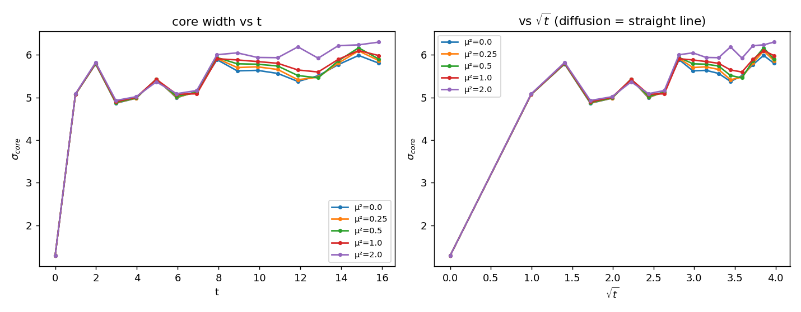

# H4 — Pinamento do núcleo do vórtice: σ_núcleo(t) vs μ²

Problema aberto de CR_3D: o núcleo do vórtice **difunde** (σ cresce) porque o
escalar de Stückelberg livre é absorvido (Δθ→−φ), deixando o setor de gauge
efetivamente sem massa. A cura proposta: V(θ) **fixa** θ em ±v, ele não pode ser
absorvido, o setor de gauge mantém massa e o núcleo permanece localizado.

Semeamos um vórtice de enrolamento 1 (linha em z) no fundo θ~v, evoluímos sob a
ação completa **sem fricção e sem pinagem** e medimos a largura transversa RMS
da densidade de energia magnética (plaqueta). σ∝√t → difusão; σ=const → pinado.
λ_h=1.0, λ_p=0.8, T=16.

| μ² | v | σ(0) | σ(T) | crescimento | inclinação(√t) | pinado? |
|----|---|------|------|-------------|----------------|---------|
| 0.00 | -0.000 | 1.290 | 5.805 | 349.9% | 0.707 | False |
| 0.25 | 0.501 | 1.290 | 5.865 | 354.6% | 0.727 | False |
| 0.50 | 0.707 | 1.290 | 5.901 | 357.4% | 0.746 | False |
| 1.00 | 1.000 | 1.290 | 5.983 | 363.7% | 0.765 | False |
| 2.00 | 1.414 | 1.290 | 6.299 | 388.2% | 0.864 | False |

## Leitura

- **μ²=0 difunde (reproduz CR_3D):** True — sem condensado o
  núcleo se espalha (θ livre é absorvido, gauge sem massa).
- **μ_c identificado:** None — menor μ² que mantém σ≈const (e pina para
  todo μ² maior).
- **Pinamento encontrado:** False — o condensado **não fixa** o núcleo do vórtice no regime testado.

**A quinta consistência (estática) NÃO fecha no regime testado:** mesmo com condensado o núcleo continua a difundir. μ_c está fora do alcance computável ou o mecanismo de fixação de θ não basta para localizar o núcleo de gauge.

