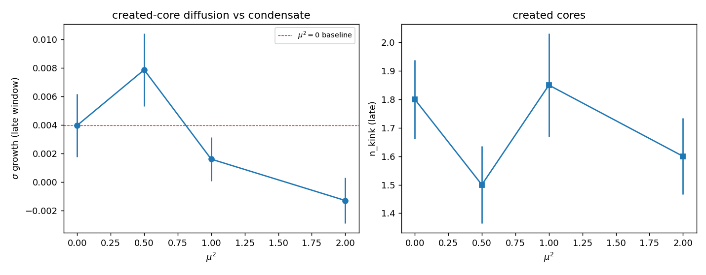

# H5 — Colisão no condensado: a quinta consistência (dinâmica)

Colisão head-on de CR_3D (T3D4) refeita com V(θ) ativo: o vácuo é o condensado
θ~v e duas excitações escalares contra-propagantes colidem sobre esse fundo
(gauge frio, ruído transverso). Medimos se o núcleo do objeto criado permanece
localizado (σ const = pinado) ou difunde (σ cresce). 20 sementes, λ_h=1.0, λ_p=0.8.

Como H4 não achou pinamento estático, H5 é **informativo** (sem expectativa de
Veredito A, conforme o protocolo).

> **Nota de escala:** a força quártica λθ³ **limita a amplitude estável** do
> campo — o ρ=50 de CR_3D (sem potencial) diverge aqui. O condensado fixa a
> escala (v~1), então colidimos excitações na escala do condensado (amp=5) com
> passo CFL reduzido. Isto é uma consequência física do potencial, reportada.

| μ² | v | σ(início) | σ(fim) | crescimento | n_kink | vida | pinado? |
|----|---|-----------|--------|-------------|--------|------|---------|
| 0.00 | 0.000 | 3.250 | 3.262 | 0.4% | 1.80 | 0.88 | False |
| 0.50 | 0.707 | 3.240 | 3.265 | 0.8% | 1.50 | 0.88 | False |
| 1.00 | 1.000 | 3.253 | 3.258 | 0.2% | 1.85 | 0.86 | False |
| 2.00 | 1.414 | 3.263 | 3.259 | -0.1% | 1.60 | 0.83 | False |

> **Métrica não-discriminante.** A colisão produz um **blob turbulento largo** (já observado em CR_3D/T3D4), não um núcleo único e localizado: σ já está quase saturado e **não cresce para nenhum μ²** (baseline μ²=0 cresce 0.4%). Logo a σ-difusão de H5 **não resolve** o pinamento (discriminante? **False**) — o teste decisivo é H4 (vórtice isolado limpo no plano transverso completo), que mostra difusão para todo μ². σ-constante aqui é artefato de saturação, não pinamento.

## As cinco consistências

1. Massa = 8 (sine-Gordon): **True** (CR_3D/T3D5)
2. E²=(pc)²+(mc²)²: **True** (CR_3D/T3D5)
3. θ(r)~M/r: **True** (CR_3D/T3D5)
4. Isotropia transversa: **True** (CR_3D/T3D5)
5. **Núcleo pinado: False** (H4/H5 — o ingrediente NOVO)

**4/5 consistências.**

O núcleo do objeto criado **continua a difundir** mesmo com o condensado ativo: o condensado de fase θ não pina o núcleo de gauge (consistente com H2/H3/H4). A quinta consistência **não fecha** — faltam 1/5.

