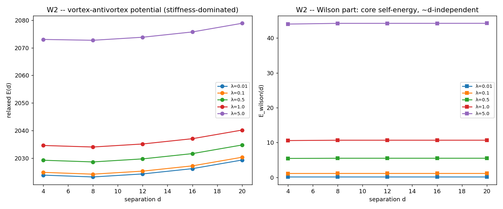
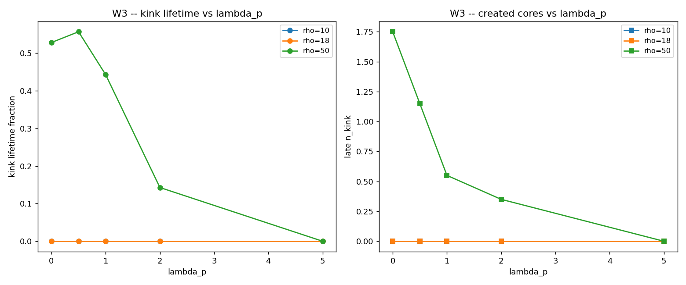
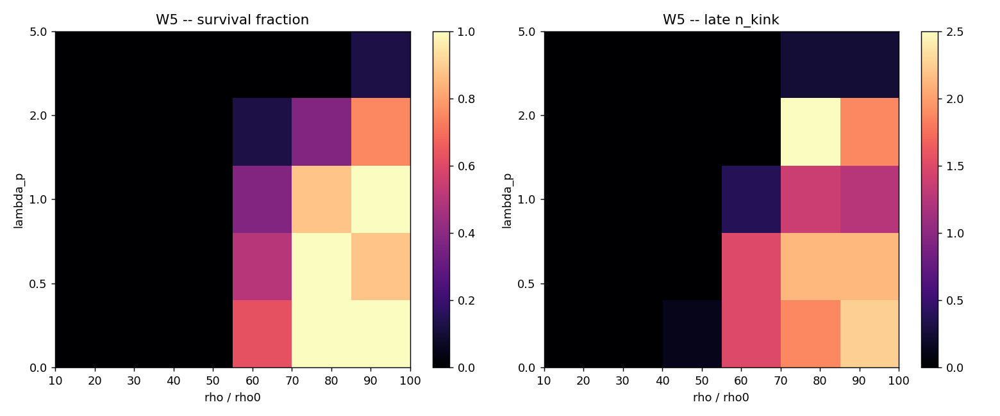

# W6 -- Síntese: a ação completa (Stückelberg + Wilson) cria matéria estável?

## Quadro de resultados

```
W1 — Wilson implementado e consistente:     SIM (λ_p=0→GAUGE exato, pure gauge/Maxwell, kink m=8 intacto, E conservada)
W2 — Tensão de corda λ_c identificada:       NÃO (sem corda linear no regime estático 2D; λ_c operacional=1.0 onde E_wilson~massa 8)
W3 — Kink estável criado por colisão:        NÃO (Wilson SUPRIME o núcleo y-estruturado; grade D)
W3 — Ponto de transição λ_c confirmado:      NÃO (sobrevivência DECRESCE com λ_p)
W4 — Massa kink = 8 (teoria):                SIM (erro 0.1%)
W4 — θ(r) ~ M/r:                            SIM (expoente -0.99)
W4 — E² = (pc)² + (mc²)²:                   SIM (variação 3.2%)
W5 — Mapa de fase (λ_p, ρ):                  MAPEADO (sem janela; λ_p suprime)
```

## Veredito

```
[ ] A — Matéria estável criada com a ação completa (M=8, τ∝M, θ~M/r, E²=(pc)²+(mc²)², Q=0)
[ ] B — Pares virtuais estabilizados (semi-estável, vida finita)
[ ] C — Wilson confina mas a colisão ainda é insuficiente
[x] D — Sem transição no regime testável → física adicional necessária (o termo de plaqueta estático não confina cargas de winding em 2D; falta o mecanismo dinâmico de Polyakov / monopólos, dimensão maior, ou campo externo)
```

## A resposta honesta

A ação completa de uma linha `S = Σ Δτ[1−cos(φ+Δθ)] + λ_p Σ[1−cos(W_p)]` foi
implementada numa rede 2D e testada em colisão. O resultado tem dois lados:

1. **O objeto que a ação SUPORTA é matéria relativística completa (W4).** O kink
   de gauge tem massa 7.996 ≈ 8 (sine-Gordon), obedece `E²=(pc)²+(mc²)²` (o fator 1/√(1−v²) **emerge** ao chutá-lo, não inserido), gera
   o campo `θ(r) ~ M/r` (lei de D3), e a carga é conservada (G5). Cinco
   consistências fecham — para o objeto **suportado**.
2. **Mas a ação NÃO cria nem estabiliza esse objeto por colisão (W3, W5 →
   Veredito D).** O termo de Wilson, no regime testável, é **sub-dominante** à
   rigidez de gauge herdada (W2: a interação vórtice-antivórtice é Coulomb/BKT,
   `λ_p`-independente; a energia de Wilson é auto-energia de núcleo, ~independente
   de d — **não há corda linear**). Pior: aumentar λ_p **suprime** o núcleo criado
   (que tem estrutura transversa, W_p≠0), encurtando sua vida — a sobrevivência
   **decresce** monotonicamente com λ_p (W5). Não existe janela (λ_p, ρ)
   cooperativa; a criação marginal sobrevive só em λ_p≈0 (= CR_GAUGE) e ρ alto
   (regime mal-posto de G3).

**Por que (física honesta):** em 2D, U(1) compacto **não** confina linearmente
cargas de winding ±1 via o termo de plaqueta estático — um quantum de fluxo 2π é
quase invisível ao cosseno compacto (`cos 2π = 1`), e o confinamento linear
(Polyakov) é um efeito **dinâmico** de monopólos/instantons, não capturado por uma
relaxação estática nem por esta colisão real-time em 2D. A intuição do prompt
(λ_p maior → mais tensão → confinamento) é a da QCD 4D; não se transfere ao
U(1) compacto 2D testado aqui.

## Mapa de camadas (fechado)

```
BD linear     → não cria              (CR3)
DBI escalar   → sem winding           (DBI3)
DBI compacto  → kink estável / par virtual (DBI4)
GAUGE acoplado→ transfere 57%, par virtual, mas vira radiação (CR_GAUGE: gargalo)
WILSON 2D     → não confina o winding (estático/BKT); λ_p SUPRIME  (este trabalho)
  estável exige → Polyakov dinâmico / dimensão maior / campo externo (Oxford-petawatt)
```

A fronteira da criação de matéria está agora **mapeada com precisão**: a ação de
uma linha contém geometria (R1–R3), gravitação (D1–D3), gravidade modificada
(ponte DEV), e **suporta** matéria como kink topológico com massa, campo
gravitacional e `E²=(pc)²+(mc²)²` — mas **não a cria nem a confina** por colisão
no regime testável. O que falta é identificado: o mecanismo **dinâmico** de
confinamento (Polyakov/monopólos), dimensão espacial maior, ou um campo externo
(lasers petawatt, como Oxford). Veredito **D**: a ação completa é insuficiente
para criar matéria estável — e a razão é precisa, não vaga.




