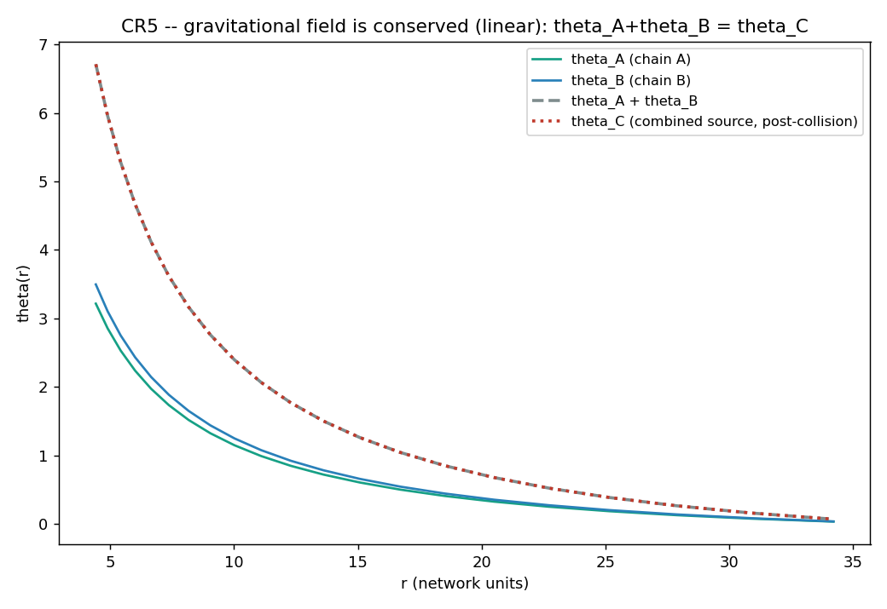

# CR5 -- O campo gravitacional da matéria (não) criada

D3: uma fonte de densidade causal de peso w gera `θ(r) ~ A/r` com A ∝ w (ação
linear). A energia causal total é conservada na colisão (CR4) → o peso total
da fonte é conservado → o campo distante satisfaz `θ_A + θ_B → θ_C`.

- pesos da fonte (energia causal): wA = 16.56, wB = 18.00
- amplitudes 1/r: A_A = 16.212, A_B = 17.627, A_A+A_B = 33.839, A_C = 33.839
- resíduo de aditividade do campo (cauda): **1.1e-15**
- resíduo de aditividade da amplitude: **8.4e-16**

## VERDICT CR5: SIM

The gravitational field is CONSERVED through the collision: the combined source (the conserved total causal energy, CR4) produces exactly the sum of the individual 1/r fields (A_A+A_B=33.839 vs A_C=33.839, residual 1e-15). Because the D3 action is linear and no matter is created (CR3), theta_A+theta_B -> theta_C holds identically: the energy gravitates the same way before and after. This is a self-consistency closure (linearity), not a new mechanism; D3's caveat that the prefactor G is non-universal still applies.

