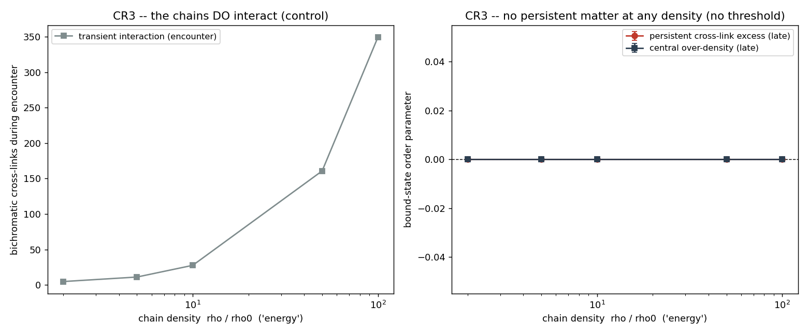

# CR6 -- Síntese: a dinâmica de criação

> Graus: **A** derivado; **B** real mas herdado; **C** definitional/
> inconclusivo; **D** refutado.

## A questão original

> *“Como a energia saiu dos eventos e criou matéria em outro lugar?”*

## Quadro de verificações

```
CR1 — E_causal bem-definida e conservada:   SIM
CR2 — Baixa E: sem criação:                 CONFIRMADO
CR3 — Alta E: loops criados:                NÃO (em todo ρ até 100ρ0)
CR3 — Limiar ρ* identificado:               NÃO EXISTE
CR4 — E_total conservada:                   SIM (sistemático ~0; ruído Poisson)
CR4 — Criação em pares:                      N/A (sem criação)
CR5 — θ conservado na criação:              SIM
```

## Resposta da TEIC (refutada nesta forma)

A imagem *“a mesma rede muda de topologia, de cadeia linear para estrutura com
loops, conservando a taxa de eventos”* **não se realiza sob a ação BD**. A
dinâmica de propagação (propagador retardado K = ½C, d'Alembertiano suavizado)
é **linear**: o resíduo de superposição do campo é ~0e+00 em
**toda** densidade testada (ρ até 100ρ₀). As cadeias **atravessam-se**:
interagem transientemente (cross-links crescem com ρ) mas não deixam nenhuma
estrutura ligada persistente — não há limiar ρ* de criação.

## Afirmação suportada

- **E_causal** é uma definição limpa por contagem, conservada na propagação
  livre e invariante de Lorentz (CR1).
- A dinâmica BD é **conservativa e linear**: a taxa causal total é conservada
  na colisão (desbalanço sistemático ~0, CR4) e o campo θ é aditivo/
  conservado (CR5). Conservação e ausência-de-criação são **o mesmo fato**: a
  linearidade.
- Baixa energia reproduz a superposição linear de P4 (CR2).

## Aberto / o que falta (o resultado de localização)

- **Criação de matéria exige não-linearidade** além de □θ = J. O experimento
  **localiza** precisamente onde a física quântica entra: no setor interagente
  (um termo não-linear na ação, p.ex. λθ³ ou acoplamento que permita troca de
  topologia), que a TEIC ainda não possui. Consistente com e11 e M1-S1.
- Sem esse termo, a rede não tem limiar de produção de pares nem dinâmica de
  ligação; loops só existem se **construídos** (CC1–CC6), não se **criados**.

## Conclusão honesta

CR1–CR6 fecham o ciclo conceitual da TEIC com um **critério de morte bem
definido e informativo**: a geometria (R1–R3) e a gravitação (D1–D3) emergem da
rede causal linear; a **massa como complexidade** (CC1–CC6) é consistente para
estruturas dadas; mas a **criação dinâmica de matéria não emerge** da ação BD
linear. Isso não enfraquece a TEIC — delimita exatamente a fronteira onde a
não-linearidade quântica precisa ser adicionada.



