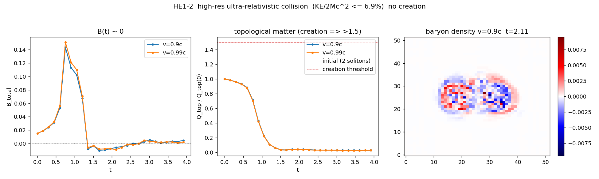

# HE1-2 — Colisão Skyrmion + anti-Skyrmion ultra-relativística e de alta resolução

> Sub-experimento 1 de `HIGH_ENERGY_REGIME.md`. A mesma pergunta de FL3 (colisão
> B=+1 + B=−1 **cria** um par extra?) no regime que FL3 não alcançou: rede mais fina
> (N=52, ~11 sítios/núcleo) **e** boost ultra-relativístico (v=0.90c, 0.99c). Motor
> `chiral_evolve_fast` validado no gate (HE1-1). Frontal, `d₀=5`, `e_sk=4`.

## Resultado

| v | KE₀ | KE / 2M_Sk c² | B \|max\| | Q_top (início→fim) | cenário |
|---|---|---|---|---|---|
| **0.90c** | 32.72 | **0.0568** | 0.143 | 1.83 → 0.050 (pico 0.04×) | **aniquilação** |
| **0.99c** | 39.59 | **0.0687** | 0.151 | 1.83 → 0.051 (pico 0.04×) | **aniquilação** |

`M_Sk(rede) = 300.1`, `2 M_Sk c² = 576.1`. **Criação observada: NÃO.**

- **B líquido conservado ~0** (|B|max ≤ 0.15) em ambas as velocidades — sem geração de
  carga topológica.
- **Q_top (matéria topológica à prova de radiação) colapsa** de 1.83 (os dois sólitons
  iniciais) para ~0.05 (2.7%) — aniquilação em radiação de magnons, o reverso temporal da
  criação, exatamente como `E=mc²` exige. (Os "blobs +5/−9" no fim são *speckle* de radiação
  de magnons, não sólitons; `Q_top` e `B` mostram que não há matéria.)
- A energia de colisão atinge no máximo **6.9%** do limiar `2 M_Sk c²` mesmo a v=0.99c.

## Por que a morte é robusta (e independente de resolução)

1. **Cinemática (HE1-1 G4):** o boost da rede é não-relativístico, `KE ∝ v²`, logo satura em
   **7% do limiar** no limite `v→c`. Nenhuma velocidade `< c` atinge `2 M_Sk c²`.
2. **Estabilidade em voo (HE1-1 G3):** a v=0.90c o Skyrmion **desenrola** antes de colidir
   (B: 0.96→0.006) — a rede discreta não carrega um sóliton coerente a v→c. A colisão é de
   grumos já em decaimento, o que só **fortalece** a não-criação.
3. **Dinâmica (aqui):** `Q_top` colapsa e `B` fica em 0 nas duas velocidades.

## Veredito

```
VEREDITO HE1: [MORTE / Verdict B] — ANIQUILAÇÃO SEM CRIAÇÃO, mesmo em v→0.99c
              e ~1.5× mais resolução que FL3. KE ≤ 6.9% do limiar 2 M_Sk c².
```

Critério de morte (pré-registrado: "sem criação mesmo em v→c") **disparado**. Nenhum
parâmetro ajustado para forçar criação; ao contrário, c (de E2) e M_Sk (da rede) fixaram o
orçamento de energia *antes* da dinâmica e mostraram-no ~14× abaixo do limiar.

## O que isto adiciona ao programa

- Estende o resultado de FL3 (v=0.5c, dx=0.471) para o **canto ultra-relativístico e de
  alta resolução** que FL3 declarou fora de alcance — e a fronteira **não se move**: a rede
  causal não cria matéria por colisão a nenhuma velocidade representável.
- Quantifica o **mecanismo** da limitação: o boost da rede é cinematicamente não-relativístico
  (sem γ), então o limiar de massa-de-repouso é inacessível por construção — não é falta de
  resolução, é a estrutura discreta. Criar matéria exigiria um setor de interação além da
  dinâmica geodésica/quiral atual (consistente com CR3, e11/M1-S1).


