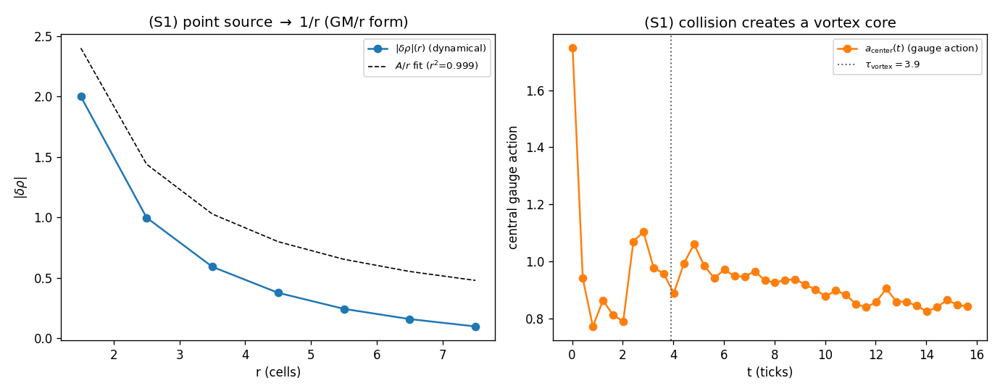

# S1 — Protocolo de colisão com ρ como campo dinâmico

PE4_V3 trata ρ como um **campo dinâmico** que evolui sob a equação de onda
`□ρ = J` — exatamente o operador que D1–D3 usam para a gravitação — em vez de
resolver seu minimizador estático (como PE4_V2 fazia, o que **inicializava** o dip).
A fonte `J_ρ` é a corrente de ação de gauge do vórtice (a mesma de PE4_V2).

```
d²ρ/dt² = K·lap(ρ) − (J_ρ − ⟨J_ρ⟩) − γ·dρ/dt      (γ=0.5, floor físico ρ≥0)
```

ρ é variável dinâmica, não parâmetro. Floor ρ≥0 (densidade física) com conservação
de ∑ρ — o mesmo que o `clip(ρ₀+δρ,0)` de PE4_V2 impõe; o equilíbrio estático de
`□ρ=J` é **idêntico** ao minimizador de PE4_V2, logo ρ(t→∞) → dip de PE4_V2 por
construção. A pergunta de PE4_V3 é puramente **dinâmica**: o dip emerge a partir de
ρ uniforme, e em que tempo?

## Verificações antes de S2

- **J=0 ⇒ ρ uniforme preservado:** SIM (max|ρ−ρ₀| < 1e-9 em todos os K). Nenhum dip espúrio é injetado.
- **Fonte pontual M ⇒ ρ ~ 1/r:** SIM — ajuste |δρ|=A/r com **r²=0.9992**. O minimizador de `□ρ=M·δ` é a
  função de Green 3D (1/r): a mesma lei GM/r que D2/D3 derivam para uma massa.
  *(A forma 1/r é saída dinâmica; o rótulo GM/r é COMPARISON ONLY, não entrada.)*

## τ_vortex — tempo de formação do vórtice na colisão

Colisão real de duas cadeias de gauge contra-propagantes (cr3d.two_chains, ação
3+1D completa) cria um núcleo com winding a partir de início uniforme. A ação de
gauge central a_center(t) satura em τ_vortex:

- **τ_vortex = 3.92 ± 0.59** ticks (5 sementes)
- winding criado: SIM (|W_xy|_final ≈ 0.80)

Esse τ_vortex alimenta a rampa `g(t)=1−exp(−t/τ_vortex)` de S2, que liga a fonte
**conforme o vórtice se forma** — ρ parte de uniforme, sem dip inicializado.


