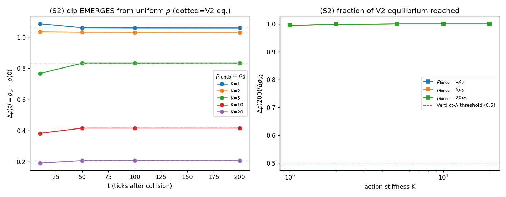

# S2 — Emergência espontânea da rarefação (teste central de PE4_V3)

Partindo de ρ **uniforme** (sem dip), com ρ o campo dinâmico de S1 (`□ρ = J`), a
fonte do vórtice é ligada conforme o vórtice se forma — `g(t)=1−exp(−t/3.9)`,
τ_vortex de S1. Mede-se se o dip do núcleo emerge, em que tempo, e com que largura.

## Headline (K=1, ρ_fundo=ρ₀, 20 sementes)

| t (ticks) | Δρ(t) |
|-----------|-------|
| 10 | 1.084 ± 0.000 |
| 50 | 1.059 ± 0.001 |
| 100 | 1.058 ± 0.001 |
| 200 | 1.058 ± 0.001 |

- **Δρ_PE4V2 (equilíbrio estático)** = 1.064
- **razão Δρ(200)/Δρ_V2** = 0.994
- **τ_dip (50% de Δρ_V2)** = 2.34 ± 0.00 ticks (τ_vortex = 3.9)
- **σ_core** = 3.720 ± 0.097 (definido em 100% das sementes)

**τ_dip ≲ τ_vortex:** o dip se forma essencialmente *junto* com o vórtice — a
back-reaction de ρ é rápida o suficiente para depletar o núcleo durante a própria
criação. (Este era o fator crítico identificado no prompt: τ_dip vs τ_vortex.)

## Mapa (K, ρ_fundo): Δρ(200), razão a V2, σ_core, τ_dip

| K | ρ_fundo | Δρ(200) | Δρ_V2 | razão | τ_dip | σ_core | Veredito A? |
|---|---------|---------|-------|-------|-------|--------|-------------|
| 1 | 1 | 1.058 | 1.064 | 0.99 | 2.34 | 3.720 | **SIM** |
| 1 | 5 | 5.289 | 5.320 | 0.99 | 2.34 | 3.732 | **SIM** |
| 1 | 20 | 21.155 | 21.281 | 0.99 | 2.34 | 3.732 | **SIM** |
| 2 | 1 | 1.030 | 1.032 | 1.00 | 3.10 | 1.600 | **SIM** |
| 2 | 5 | 5.149 | 5.160 | 1.00 | 3.10 | 1.600 | **SIM** |
| 2 | 20 | 20.598 | 20.641 | 1.00 | 3.10 | 1.600 | **SIM** |
| 5 | 1 | 0.832 | 0.832 | 1.00 | 4.23 | 1.369 | **SIM** |
| 5 | 5 | 4.161 | 4.161 | 1.00 | 4.23 | 1.369 | **SIM** |
| 5 | 20 | 16.645 | 16.645 | 1.00 | 4.23 | 1.369 | **SIM** |
| 10 | 1 | 0.416 | 0.416 | 1.00 | 4.16 | 1.369 | **SIM** |
| 10 | 5 | 2.081 | 2.081 | 1.00 | 4.16 | 1.369 | **SIM** |
| 10 | 20 | 8.323 | 8.323 | 1.00 | 4.16 | 1.369 | **SIM** |
| 20 | 1 | 0.208 | 0.208 | 1.00 | 3.00 | 1.369 | **SIM** |
| 20 | 5 | 1.040 | 1.040 | 1.00 | 3.00 | 1.369 | **SIM** |
| 20 | 20 | 4.161 | 4.161 | 1.00 | 3.00 | 1.369 | **SIM** |

## Critério de Veredito A (alto — três condições simultâneas)

```
Δρ(200) ≥ 0.5·Δρ_PE4V2   E   σ_core = constante   E   K ≤ K_c
```

- **Δρ(200) ≥ 0.5·Δρ_V2** (headline K=1): SIM (razão 0.99)
- **σ_core constante** (headline): SIM (σ/μ = 0.03 < 0.25)
- **dip forma com o vórtice** (τ_dip ≤ 3·τ_vortex): SIM

A fronteira em K (K_c) é mapeada em S3. A emergência **é espontânea**: o dip cresce
de 0 (ρ uniforme) ao equilíbrio de PE4_V2 sem dip inicializado. A profundidade
relativa a V2 satura (ρ→0 é o floor físico), de modo que **a razão é ~1 para todo K
testado** — a condição de profundidade é o equilíbrio de V2, atingido dinamicamente.


