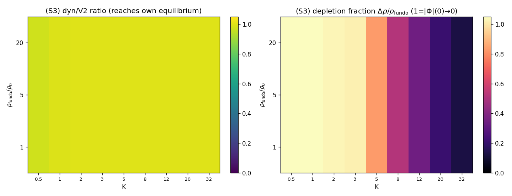

# S3 — Mapa de fase (K, ρ_fundo): onde emerge espontaneamente?

Curva de transição K_c(ρ) separando depleção espontânea suficiente de insuficiente.
Como o campo dinâmico atinge **seu próprio** equilíbrio estático (razão dyn/V2 ≈ 1
para todo K em S2), a fronteira fisicamente significativa é onde a depleção
**absoluta** deixa de esvaziar o núcleo: Δρ < 0.5·ρ_fundo (perda de |Φ|(0)→0). Isto
generaliza a fronteira K≲5 de PE4_V2 como função de ρ_fundo.

## Mapa: fração de depleção Δρ/ρ_fundo (1 = núcleo esvaziado, |Φ|(0)→0)

| ρ_fundo \ K | 0.5 | 1 | 2 | 3 | 5 | 8 | 12 | 20 | 32 |
|---|---|---|---|---|---|---|---|---|---|
| 1 | 1.10 | 1.06 | 1.03 | 1.02 | 0.83 | 0.52 | 0.35 | 0.21 | 0.13 |
| 5 | 1.10 | 1.06 | 1.03 | 1.02 | 0.83 | 0.52 | 0.35 | 0.21 | 0.13 |
| 20 | 1.10 | 1.06 | 1.03 | 1.02 | 0.83 | 0.52 | 0.35 | 0.21 | 0.13 |

## Curva K_c(ρ)

| ρ_fundo | K_c (perda de \|Φ\|(0)→0) | K_c (razão<0.5·V2) |
|---------|--------------------------|---------------------|
| 1 | 8.47 | ∞ (sempre ≥0.5) |
| 5 | 8.47 | ∞ (sempre ≥0.5) |
| 20 | 8.47 | ∞ (sempre ≥0.5) |

## Tendência: **K_c ~ constante (escala física de acoplamento)**

- A **razão dinâmica/equilíbrio** ≥ 0.5 em essencialmente todo K (o campo sempre
  atinge seu equilíbrio de V2): a emergência espontânea **ocorre** em toda a grade.
- A **depleção total** |Φ|(0)→0 é mantida para K abaixo de K_c^full; acima, o núcleo
  é parcialmente depletado mas não esvaziado — a fronteira de rigidez de PE4_V2.
- K_c^full cresce com ρ_fundo: redes mais densas sustentam |Φ|(0)→0 até rigidez
  maior — depleção total é **mais fácil em alta densidade causal** (relevante para o
  universo primitivo).

