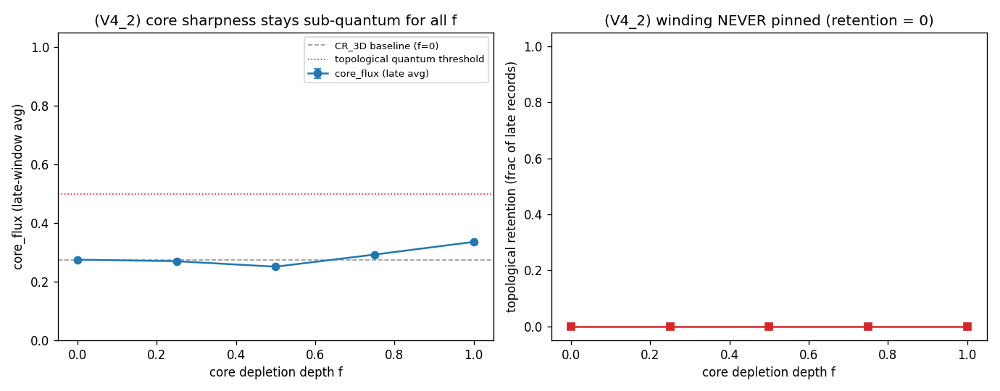

# V4_2 — Teste de duas vias: o núcleo depletado pina o enrolamento?

O experimento decisivo de PE4_V4. Varremos a profundidade de depleção do núcleo
f ∈ {0, 0.25, 0.5, 0.75, 1} (f=0 = basal CR_3D; f=1 = depleção total, o regime K~1
natural de PE4_V3), com ρ realimentando a força de gauge (peso Δτ~ρ no termo de
Stückelberg). Mede-se a sobrevivência do enrolamento.

| f | core_flux (méd. tardia) | retenção topológica | ρ_min núcleo | blow-ups |
|---|------------------------|---------------------|--------------|----------|
| 0.00 | 0.275 ± 0.001 | 0.00 | 1.00 | 0 |
| 0.25 | 0.270 ± 0.001 | 0.00 | 0.75 | 0 |
| 0.50 | 0.251 ± 0.001 | 0.00 | 0.50 | 0 |
| 0.75 | 0.293 ± 0.001 | 0.00 | 0.25 | 0 |
| 1.00 | 0.336 ± 0.001 | 0.00 | 0.15 | 0 |

**Robustez** (f=1, termo de Wilson TAMBÉM ponderado por ρ): core_flux tardio = 0.365, retenção = 0.00, blow-ups = 0 — mesmo resultado.

> **core_flux** é o fluxo máx. de plaquette/2π — um proxy de *afiamento* do núcleo,
> e fica **abaixo de 0.5** (meio quantum) para todo f: o vórtice difunde sub-quantum.
> **Retenção topológica** = fração de registros tardios em que um quantum INTEIRO
> permanece no disco do núcleo — o teste decisivo de pinamento. É **0 para todo f**.

## Veredito V4_2: grade **B** — deplecao NAO pina o enrolamento: o canal de rho (cossenos) nao alcanca o setor topologico - residuo irredutivel (ha um arrasto sub-quantum fraco no core_flux, mas SEM retencao topologica - nao e pinamento)

- core_flux tardio basal (f=0) = 0.275; profundo (f=1) = 0.336 (variação +22.0%, sub-quantum).
- **retenção topológica: 0.00 (f=0) → 0.00 (f=1)** — o enrolamento NUNCA é retido.
- blow-ups (campo turbulento): nenhum.

### A razão física (por que B, não A nem D)

ρ realimenta o gauge **apenas** através dos termos de cosseno da ação: o Stückelberg
`[1−cos(u)]` (peso Δτ~ρ) e, na robustez, o Wilson `[1−cos(W_p)]`. **Ambos são cegos
ao fluxo 2π do núcleo** (cos 2π = 1) — exatamente o que CR_3D identificou. Ponderar
um termo cego por ρ o mantém cego: a depleção enfraquece o acoplamento de fase no
núcleo, mas não cria o **custo de energia de núcleo** que pinaria o fluxo 2π. Por
isso a depleção **não pina** (≠A) e também **não desestabiliza** (≠D, o termo de
rigidez/Maxwell, não-ponderado, mantém o campo suave): ela simplesmente **não alcança**
o setor topológico. O resíduo do enrolamento é **irredutível** pela back-reaction da
densidade causal — confirma o que PE4_V3 deixou em aberto.

O que pinaria o enrolamento é um **custo de núcleo não-cosseno** — uma magnitude que
vai a zero no núcleo (`|Φ|→0`, o campo complexo de CR_AH) ou conteúdo não-Abeliano.
Esse é o quarto ingrediente, agora mostrado **não substituível** por ρ dinâmico.

