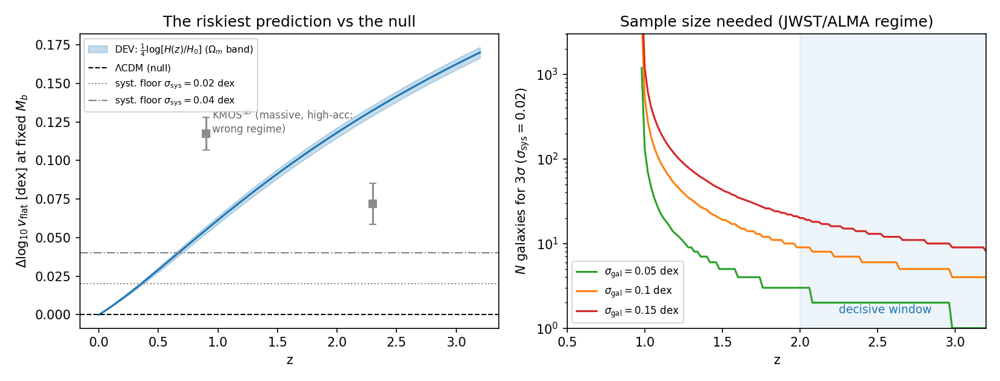

# F1 — Forecast do teste decisivo da BTFR (a previsão mais arriscada)

> Ataque 4 do `ROADMAP_REVOLUCAO.md`. Responde Q10 do revisor: *"qual é a previsão mais
> arriscada?"* — e quantifica **exatamente** o que decide. Usa a mesma previsão e
> cosmologia de `results/falsification/btfr_v2/B1` (H₀ cancela; banda de Ωm=0.30±0.02).

## Veredito: **o gargalo é SISTEMÁTICO, não estatístico** — a decisão exige z≳2 e σ_sys≲0.03 dex; lá, ~10 galáxias bastam

```
z      sinal (dex)   teto S_max (σ_sys=0.04)   teto S_max (0.02)   N p/ 3σ (σ_gal=0.10, σ_sys=0.02)
1.0    +0.0614            1.5σ  ←hoje               3.1σ                 522
1.5    +0.0914            2.3σ                      4.6σ                  19
2.0    +0.1181            3.0σ                      5.9σ                   9
2.5    +0.1415            3.5σ                      7.1σ                   6
3.0    +0.1624            4.1σ                      8.1σ                   4
```


## As três conclusões

1. **Por que os dados atuais não decidem — agora é quantitativo.** Com o piso
   sistemático do estado da arte (σ_sys≈0.04 dex: suporte de pressão, beam smearing,
   calibração de M_b — nada disso cai com √N), o teste em z~1 **satura em 1.5σ**
   independentemente do tamanho da amostra. A tensão tentativa de ~1.6σ de `F_JWST`
   não era falta de galáxias: era o teto sistemático. Coerência perfeita entre o
   forecast e o que foi medido.

2. **A janela decisiva: z ≥ 2, regime de baixa aceleração, σ_sys ≤ 0.03 dex.** Aí o
   sinal (+0.12 a +0.16 dex) fica 4–8× acima do piso e **N≈10–25 rotadores ricos em
   gás** dão 3–5σ. Alvos: discos gasosos de baixa massa com JWST (cinemática de
   linhas) e ALMA (CO/[CII]) — não as galáxias massivas do KMOS³D (regime Newtoniano,
   onde o sinal de a₀(z) é intrinsecamente fraco; ressalva B5 respeitada).

3. **O teste é simétrico — mata um dos dois.** ΛCDM prevê exatamente 0. Se a amostra
   decisiva medir Δlog v > 0 a ≥5σ, ΛCDM (evolução nula da BTFR) está excluída; se
   medir ≤ 0, a previsão da teoria morre.

## Kill criterion (pré-registrado)

> Se uma amostra de **N ≥ 25** rotadores ricos em gás de baixa massa, **z ≥ 2**, no
> regime **a ≲ a₀**, com sistemáticos de zero-point **≤ 0.03 dex**, medir
> **Δlog v_flat ≤ 0** (não-evolução ou decrescente a massa bariônica fixa) — a previsão
> está **falsificada**, e com ela o setor galáctico da teoria. Sem apelação a
> sistemáticos: o critério já os inclui.

## Honestidade

- A previsão `Δlog v=¼log[H/H₀]` herda da teoria DEV a identificação a₀∝H(z), que a
  geometria da rede **não deriva** (C3: X₀∝ρ é UV; nota do Paper I). O que a TEIC
  fornece é a *estrutura de operadores*; a evolução de a₀ é da camada fenomenológica.
  Se F1 falsificar, morre o setor galáctico da EFT, não o setor geométrico (R1–R4).
- Os pontos KMOS³D no painel esquerdo estão no **regime errado** (massivas, alta
  aceleração) — plotados em cinza como contexto, não como teste.
- Barras dos pontos: piso estatístico (σ_b/a); sistemáticos dominam (ver
  `FALSIFICATION_BTFR_V2.md`).

`F1_forecast.{py,json,png}` — reprodutível, sem semente (determinístico).
