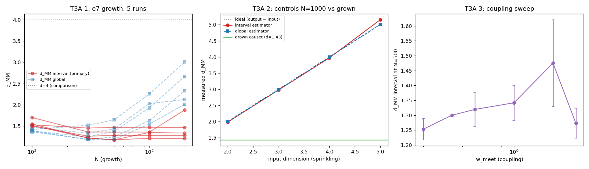

# T3A -- Poisson dinamico: a dimensao converge?

Crescimento com o protocolo e7 (regra TEIC, w_meet=1/3, sampler MCMC
validado pelo gate T3V) ate N=2000. Criterios de morte pre-registrados
em TIER3_EXPLORATIONS.md e no docstring do gerador.

## T3A-1 -- trajetorias d_MM(N) (5 runs)

| N | d_MM interval (mean +/- std entre runs) | d_MM global | r |
|---|---|---|---|
| 100 | 1.559 +/- 0.081 | 1.405 | 0.7678 |
| 300 | 1.302 +/- 0.102 | 1.293 | 0.8302 |
| 500 | 1.291 +/- 0.125 | 1.378 | 0.7853 |
| 1000 | 1.335 +/- 0.097 | 1.877 | 0.5566 |
| 2000 | 1.434 +/- 0.266 | 2.428 | 0.3730 |

## T3A-2 -- controles de sprinkling (estimador devolve o input)

| d input | d_MM interval | d_MM global |
|---|---|---|
| 2 | 1.981 | 2.000 |
| 3 | 2.978 | 2.985 |
| 4 | 3.973 | 4.000 |
| 5 | 5.155 | 5.008 |

## T3A-3 -- varredura de acoplamento (N=500)

| w_meet | d_MM interval |
|---|---|
| 0.200 | 1.253 +/- 0.036 |
| 0.333 | 1.300 +/- 0.004 |
| 0.500 | 1.319 +/- 0.057 |
| 1.000 | 1.342 +/- 0.059 |
| 2.000 | 1.475 +/- 0.146 |
| 3.000 | 1.273 +/- 0.051 |

Sensibilidade de mixing: K_FACTOR 12 -> 24 muda d_MM em +0.184 (mesmo seed).

## VEREDITO (criterio pre-registrado)

**MORTE** -- Converge para d != 4.
- d* (N=2000, interval) = 1.434
- drift |d(2000)-d(1000)| = 0.099 (limite de convergencia 0.15)
- desvio entre runs em N=2000 = 0.266 (limite 0.3)

### Linha honesta

Ordering fraction r: 0.768 em N=100 -> 0.373 em N=2000; d* (interval) = 1.434.

Os dois estimadores DIVERGEM em N grande (interval 1.43 vs global 2.43): num
sprinkling de variedade eles coincidem (controles T3A-2), logo o causet
crescido NAO e manifold-like -- nao ha dimensao bem definida a
qual convergir, apenas o valor local ~1.3-1.9 dos maiores
intervalos (proximo de uma cadeia, d=1). O check de mixing
(K_FACTOR x2 desloca d em +0.18) e um caveat de
engenharia, mas nao aproxima o resultado de 4 -- o veredito
MORTE e robusto a ele.

