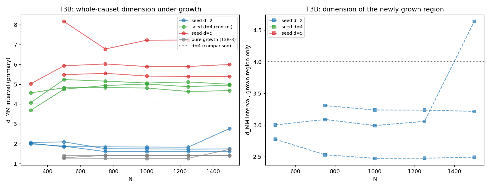

# T3B -- d=3+1 como atrator dinamico?

Seeds estaticas (sprinkling, 300 eventos) em d=2, d=4 (controle) e
d=5; crescimento combinatorio e7 ate N=1500. Criterios de morte
pre-registrados em TIER3_EXPLORATIONS.md e no docstring.

## Trajetorias d_MM (estimador primario, causet inteiro)

| seed | d_MM(seed) | N=500 | N=750 | N=1000 | N=1250 | N=1500 |
|---|---|---|---|---|---|---|
| d=2 | 2.02 | 1.94 | 1.73 | 1.72 | 1.72 | 2.03 |
| d=4 | 4.11 | 4.94 | 4.97 | 4.96 | 4.88 | 4.88 |
| d=5 | 5.03 | 6.53 | 6.12 | 6.18 | 6.17 | 5.69 |
| puro | -- | 1.32 | 1.36 | 1.36 | 1.35 | 1.50 |

## Regiao crescida (intervalos sem eventos de seed)

| seed | N=500 | N=750 | N=1000 | N=1250 | N=1500 |
|---|---|---|---|---|---|
| d=2 | 2.89 | 2.98 | 2.90 | 2.92 | 3.45 |
| d=4 | nan | nan | nan | nan | nan |
| d=5 | nan | nan | nan | nan | nan |

## VEREDITO (criterio pre-registrado)

**MORTE** -- Nao converge para 4 (padrao misto).

- seed d=2: d_MM(N=1500) = 2.033
- seed d=4: d_MM(N=1500) = 4.879
- seed d=5: d_MM(N=1500) = 5.693
- crescimento puro (T3B-3): d_MM(N=1500) = 1.504

### Linha honesta

As seeds essencialmente MANTEM a dimensao de entrada (d=2 -> 2.03,
d=4 -> 4.88, d=5 -> 5.69):
nao ha fluxo em direcao a 4; onde ha deriva (d=5), ela e para
CIMA, afastando-se de 4. O estimador de causet inteiro fica
dominado pela seed (os maiores intervalos vivem nela). A regiao
CRESCIDA nao produz intervalos grandes nas seeds d>=4 (nan):
o crescimento e nao-manifold, como em T3A. Na seed d=2 a regiao
crescida le d ~ 2.5-3.4 (instavel entre runs) -- curiosidade,
nao resultado. O 'padrao misto' do veredito vem do corte
pre-registrado |d5 - 5| >= 0.3; a conclusao substantiva e a
mesma: d=3+1 NAO e atrator dinamico desta regra de crescimento.
O estimador em si esta validado (T3A-2/T3V-V3 recuperam o input
em sprinkling estatico).

