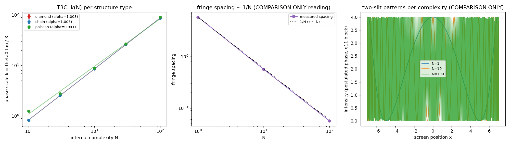

# T3C -- hbar como granularidade causal: k proporcional a N?

Escala de fase k(N) = theta0 tau(N) / X de estruturas de
complexidade interna N embebidas num meio de Poisson (rho=60, 20
sementes -- protocolo CC2), lida em franjas pela maquinaria de e11.
Criterios pre-registrados em TIER3_EXPLORATIONS.md e no docstring.

## k(N) por tipo de estrutura

### diamond (alpha = 1.008, R2 = 0.99997, k/N = 0.8638)

| N | tau (mean +/- sem) | k (mean +/- sem) |
|---|---|---|
| 0 | 0.00 +/- 0.00 | 0.000 +/- 0.000 |
| 1 | 9.95 +/- 0.32 | 0.829 +/- 0.027 |
| 3 | 30.85 +/- 0.60 | 2.571 +/- 0.050 |
| 10 | 103.15 +/- 1.17 | 8.596 +/- 0.098 |
| 30 | 312.45 +/- 1.57 | 26.037 +/- 0.131 |
| 100 | 1036.20 +/- 2.64 | 86.350 +/- 0.220 |

### chain (alpha = 1.008, R2 = 0.99997, k/N = 0.8638)

| N | tau (mean +/- sem) | k (mean +/- sem) |
|---|---|---|
| 0 | 0.00 +/- 0.00 | 0.000 +/- 0.000 |
| 1 | 9.95 +/- 0.32 | 0.829 +/- 0.027 |
| 3 | 30.85 +/- 0.60 | 2.571 +/- 0.050 |
| 10 | 103.15 +/- 1.17 | 8.596 +/- 0.098 |
| 30 | 312.45 +/- 1.57 | 26.037 +/- 0.131 |
| 100 | 1036.20 +/- 2.64 | 86.350 +/- 0.220 |

### poisson (alpha = 0.941, R2 = 0.99631, k/N = 0.9034)

| N | tau (mean +/- sem) | k (mean +/- sem) |
|---|---|---|
| 0 | 0.00 +/- 0.00 | 0.000 +/- 0.000 |
| 1 | 15.05 +/- 0.35 | 1.254 +/- 0.029 |
| 3 | 33.05 +/- 0.57 | 2.754 +/- 0.048 |
| 10 | 106.15 +/- 1.14 | 8.846 +/- 0.095 |
| 30 | 319.05 +/- 1.34 | 26.587 +/- 0.112 |
| 100 | 1086.10 +/- 3.44 | 90.508 +/- 0.287 |

## Teste de morte pre-registrado

k(100) - k(1) = 85.521 vs 5 x sem tipico = 0.525 -> SIGNIFICATIVO (nao morre)

## Leitura em franjas (COMPARISON ONLY -- fase postulada em e11)

| N | k | espacamento analitico | picos contados | espacamento dos picos |
|---|---|---|---|---|
| 1 | 0.829 | 5.879 | 3 | 6.864 |
| 10 | 8.596 | 0.567 | 25 | 0.583 |
| 100 | 86.350 | 0.056 | 227 | 0.062 |

## T3C-2 -- coeficiente e consistencia com CC2

- CC2 mediu tau/N = 10.366 links/loop (rho=60).
- Esperado k/N = theta0 (tau/N)/X = 0.8638; medido 0.8638 (razao 1.000).
- ATENCAO: a razao e 1.000 POR CONSTRUCAO -- este modulo reusa
  deliberadamente o protocolo de CC2 (mesmas sementes, mesma
  maquinaria), entao isto e uma verificacao de coerencia
  interna, NAO uma confirmacao independente.
- Leitura: com theta0 = acao-por-tick/hbar, k = m/hbar da m c^2 proporcional a tau(N) -- consistente com CC2 (m c^2 = atualizacoes internas). NAO e derivacao de hbar: e11 mostrou que a escala absoluta e EXTERNA a geometria; aqui so a ESTRUTURA (k ~ N) e medida.

## VEREDITO (criterio pre-registrado)

**SUCESSO** -- k proporcional a N (coeficiente mensuravel).
- alpha (diamantes) = 1.008  (R2 = 0.99997)
- alphas por tipo: diamond=1.008, chain=1.008, poisson=0.941
- universal entre tipos (|alpha-1| <= 0.15 em todos): SIM

### Honestidade

Para o tipo 'diamond' isto e CC2 (tau ~ N) relido pela fase de
e10/e11 -- nao e uma descoberta independente. Alem disso, os tipos
'diamond' e 'chain' produzem numeros IDENTICOS ate o ultimo digito:
o estimador tau (de CC2) usa apenas os ENDPOINTS de cada regiao
interna + o meio de Poisson -- os eventos de ramificacao do
diamante nunca entram na cadeia. Logo 'chain' NAO e confirmacao
independente; e a mesma medicao. Isso e em si um achado honesto:
o driver de tau (e de k) e a DURACAO TIPO-TEMPO interna, nao a
topologia de ciclos (Betti). O teste de tipo genuinamente distinto
e o 'poisson' (duracoes aleatorias), que mantem a linearidade.
O conteudo novo deste modulo:
(a) a leitura interferometrica (espacamento de franjas ~ 1/N);
(b) k segue o conteudo de tempo proprio, nao a topologia (acima);
(c) o coeficiente e identico ao de CC2 por construcao (coerencia). A escala ABSOLUTA de hbar continua
externa a geometria (veredito e11, inalterado).

