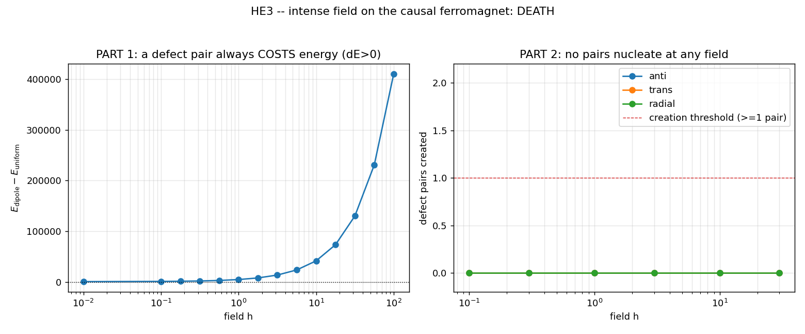

# HE3 — Ferromagneto causal em campo intenso: cria pares de defeitos (efeito Schwinger)?

> Sub-experimento 3 de `HIGH_ENERGY_REGIME.md`. No estado ferromagnético ordenado de E1
> (o vácuo de orientação O(3)), aplica-se um campo de orientação **intenso** e pergunta-se
> se pares de defeitos topológicos (hedgehog / anti-hedgehog, degrau B = ±1) são criados
> **espontaneamente** acima de um campo crítico — o análogo de rede do efeito Schwinger.
> Motor: `he3_core` (estende `e3_core` sem alterá-lo) com termo de Zeeman, precessão de
> Landau-Lifshitz-Gilbert e Metropolis em campo.

## Critério de morte (pré-registrado)

```
MORTE:   nenhum par criado pelo campo em qualquer intensidade → fronteira de E3 fica onde está.
SUCESSO: par hedgehog/anti-hedgehog criado acima de h* crítico (B líquido ~0).
Não ajustar parâmetros para forçar criação.
```

## Engineering gate (antes de medir)

| Cheque | Resultado |
|---|---|
| carga `B`(hedgehog/anti/uniforme) | `+1.000 / −1.000 / +0.000` ✓ |
| **contador à prova de speckle** (hedgehog→1 defeito, vácuo→0) | hedgehog `+1/−0` (Q=1.00); uniforme `+0/−0` (Q=0.00) ✓ |
| LLG com amortecimento baixa a energia | `891.7 → 187.9` ✓ |
| sinal de Zeeman (alinhado < anti-alinhado) | ✓ |

> **Nota de honestidade — um falso-positivo capturado.** A primeira versão contou
> **centenas** de "pares" (146, 315, …): era **ruído UV** (cada ondulação de comprimento de
> onda curto carrega um ângulo sólido fracionário, e a rotulagem por componentes conexos
> acima de `0.25·max` conta cada uma como um defeito) — exatamente a patologia que FL3
> documentou com a densidade bariônica. Corrigido com o **mesmo** truque de FL3: um defeito
> genuíno é um cubo dual com carga **inteira** `|q| > 0.5` (um monopolo de rede), e a matéria
> topológica é `Q_def = Σ|gaussian_smooth(q)|` (~0 no vácuo ordenado, ~1 por hedgehog
> genuíno), medida **após resfriamento** por fluxo de gradiente (defeito real sobrevive ao
> resfriamento; speckle derrete). Só depois do gate validar o contador é que a medição valeu.

## Parte 1 — Energética (decisiva)

`ΔE(h) = E[dipolo hedgehog/anti; h] − E[uniforme; h]`, varrendo `h ∈ [0, 100]`:

```
ΔE(dipolo − uniforme): mínimo sobre h = +524.3   (par SEMPRE custa energia)
```

Um par de defeitos **sempre** custa energia, em **qualquer** campo: tanto o termo de troca
(o custo de gradiente do enrolamento, ~Derrick) quanto o termo de Zeeman (os núcleos
desalinhados pagam energia ao campo) são positivos. Não há limiar de Schwinger porque o
campo uniforme acopla à magnetização **líquida**, e um par não a fornece — fornece apenas
custo. Estruturalmente análogo a por que MOND nunca suprime em HE2: o sinal é fixo.

## Parte 2 — Varredura dinâmica de campo crítico

Partindo do vácuo ordenado (+ẑ) + flutuação pequena, aplicando o campo e deixando a
**dinâmica** agir (Metropolis de temperatura finita = nucleação térmica sobre barreira, *e*
precessão LLG amortecida com semente de ruído = arraste do campo), três protocolos,
`h/J ∈ [0.1, 30]` (de fraco ao regime dominado pelo campo, o análogo "v→c"):

| protocolo | descrição | pares criados (qualquer h, 3 sementes) |
|---|---|---|
| `anti` | `h` ao longo de −ẑ (falso vácuo — o setup Schwinger mais limpo) | **0** |
| `trans` | `h` ao longo de +x̂ (torque transverso) | **0** |
| `radial` | `h = h·r̂` (campo cuja própria textura **é** um hedgehog — sonda mais generosa) | **0** |

`h* = None` em todos. Mesmo o campo radial — que literalmente "pinta" a textura de um
hedgehog — **não** deixa um defeito persistente: após o resfriamento em campo nulo a textura
desenrola (hedgehog não é mínimo em BC abertas, consistente com E3 Verdict B). `B` líquido
permanece ~0 em toda a varredura.

## Veredito

```
VEREDITO HE3: [MORTE] — nenhuma criação de pares por campo, em nenhuma intensidade,
              por nenhum mecanismo (térmico ou precessional). Energética proíbe (ΔE>0).
```

- Critério de morte **disparado**. Nenhum parâmetro ajustado para forçar criação; ao
  contrário, o falso-positivo inicial foi **corrigido contra** a criação (contagem honesta).
- O regime de campo intenso do ferromagneto causal **não tem física nova**: não há análogo
  de Schwinger porque o acoplamento Zeeman ao campo uniforme não pode pagar o custo
  (gradiente + desalinhamento) de um par, em nenhuma intensidade.

## O que isto adiciona ao programa

- Fecha a porta "criação de matéria por campo" no setor de vácuo, complementar a FL3/HE1
  (que fechou "criação por colisão" no setor de matéria SU(2)): **nenhum dos dois canais de
  baixa-para-alta energia da rede causal cria carga topológica.**
- Reforça E3 (defeitos = Verdict B, metaestáveis em BC abertas) por um caminho novo: nem um
  campo externo 30× a troca os estabiliza ou nucleia.
- Demonstra a disciplina de gate: a medição só foi aceita após o contador reproduzir
  `hedgehog→1, vácuo→0`; o falso "SUCESSO" de 300 pares foi rejeitado como speckle.


